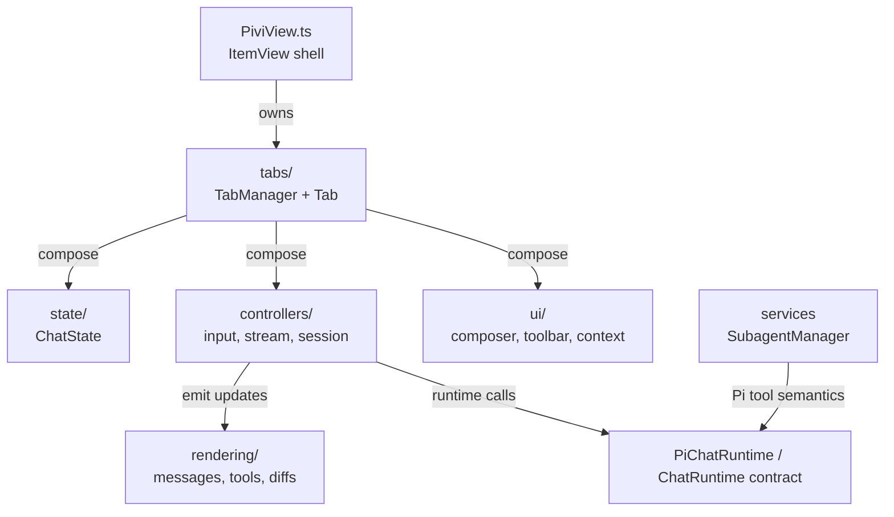

# `src/features/chat/` — Sidebar chat feature

Obsidian `ItemView` feature that hosts multi-tab Pi sessions. This is UI/application code: it composes controllers, state, renderers, UI managers, and Pi runtime/workspace services through explicit dependencies where possible.

## Feature flow

## Boundaries

- Feature code may use Pivi-owned Pi product services. Avoid importing low-level external Pi SDK packages directly.
- Prefer explicit constructor/deps wiring and plugin-owned Pi workspace services.
- Keep Obsidian DOM work in UI/rendering classes; controllers should receive dependencies through explicit interfaces.
- Preserve separation between display text/history and API prompt text; MCP transforms happen at runtime boundary.
- Clean up per-tab resources through the tab lifecycle (`dom.eventCleanups`, runtime callbacks, manager cleanup).

## Key areas

- `PiviView.ts` — view shell, command/view wiring, tab persistence hooks.
- `tabs/` — per-tab composition, lifecycle, session binding, runtime creation.
- `controllers/` — input submission/queueing, streaming, sessions/history/title/navigation.
- `rendering/` — message blocks, tool calls, thinking/todos/subagents/diffs/plan/ask-user UI.
- `ui/` — rich composer, inline context, toolbar controls, file/image/external context, status/navigation UI.
- `services/` — feature services such as subagent lifecycle interpretation.
- `state/` — central reactive chat state data and callbacks.

## Obsidian UI rules

- Prefer Obsidian DOM helpers and scoped `.pivi-*` classes.
- Icon buttons need accessible labels and keyboard paths.
- Use active document/window patterns where popout compatibility matters.
