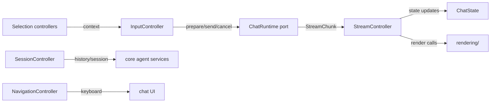

# `src/features/chat/controllers/` — Chat orchestration controllers

Controllers translate UI events and runtime streams into state/rendering updates. They are feature-layer code: depend on core ports/types and injected callbacks, never on `src/pi/**`.

## Flow

## Rules

- Keep dependencies explicit with typed `Deps` interfaces.
- Use `scheduleAnimationFrame` / active-window-safe scheduling patterns for render throttling.
- Guard streaming and async callbacks against stale tabs/sessions.
- Preserve the display/API prompt split from `PreparedChatTurn`.
