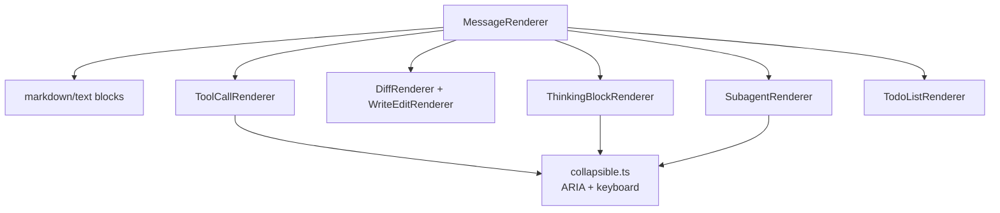

# `src/features/chat/rendering/` — Chat DOM renderers

Render structured chat state into accessible Obsidian DOM: messages, tool calls, diffs, thinking blocks, todos, plans, ask-user cards, and subagent output.

## Renderer relationships

## Rules

- Maintain live streaming and stored-history render paths; do not assume every block is created live.
- Interactive/collapsible elements need ARIA state and keyboard handling.
- Keep renderer code driven by typed state/deps. If Pi behavior is needed, pass it explicitly instead of reading globals.
- Use `.pivi-*` CSS classes; avoid inline style assignment.
