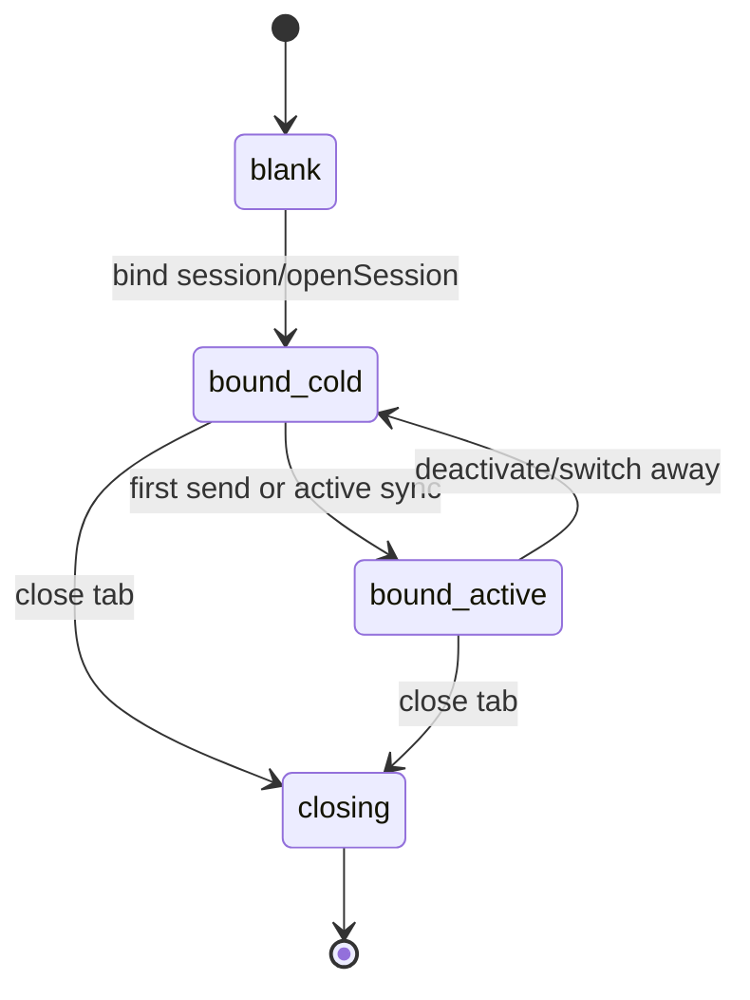

# `src/features/chat/tabs/` — Multi-tab chat orchestration

Each tab is an independently bound Pi-backed chat surface with its own runtime, state, controllers, UI managers, and session reference. Keep this directory feature-layer only: use `AgentServices`, `AgentSettingsCoordinator`, and `AgentWorkspace`; never import `src/pi/**` directly.

## Lifecycle

## Key files

- `types.ts` — tab data, lifecycle, controller/UI dependency contracts, persisted state shape.
- `Tab.ts` — per-tab composition: DOM, controllers, UI managers, input wiring, fork/render, cleanup.
- `TabManager.ts` — tab creation/switching/closing, restore/persist, SDK command warmup, fork targets.
- `TabBar.ts` — numbered badge navigation and close interactions.
- `tabRuntime.ts` / companion helpers — runtime creation/sync through core facades.

## Patterns

- Treat tab cleanup as resource cleanup: unregister DOM events, timers, runtime callbacks, and per-tab managers.
- Runtime initialization is lazy; passive session sync can happen before a Pi `Agent` is constructed.
- Guard async operations against stale tabs and `closing` lifecycle state.
- Persist tab binding as session-oriented state (`sessionFile`, `leafId`, draft model), not as Pi internal agent state.
