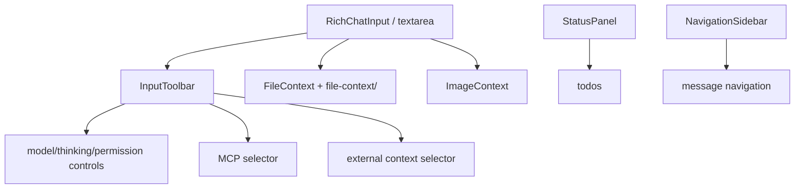

# `src/features/chat/ui/` — Chat input and toolbar UI

UI managers for the composer, context attachments, toolbar controls, navigation sidebar, and status panels. Keep runtime behavior behind callbacks supplied by tabs/controllers.

## UI composition

## Rules

- Store cleanup handles and expose `destroy()` for managers that register events.
- Use accessible labels/tooltips for icon buttons and chips.
- Preserve IME-safe input handling in composer and modal-like controls.
- Context managers should collect UI state; prompt serialization belongs at the runtime/core boundary.
