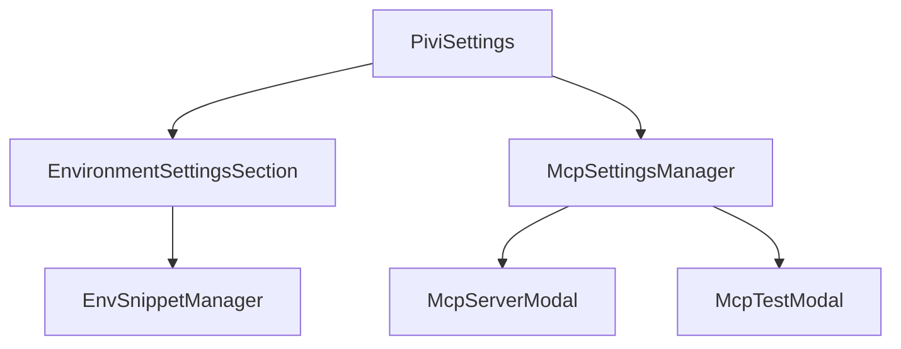

# `src/features/settings/ui/` — Settings tab UI components

Obsidian `Setting` and `Modal` based components for environment snippets, MCP server CRUD/test flows, and settings sub-sections.

## Settings UI flow

## Rules

- Use Obsidian `Setting`/`Modal` APIs and sentence-case labels.
- Keep persistence behind callbacks from the settings tab/coordinator; modals should not own global state.
- For optimistic MCP updates, provide rollback on save failure and user-readable errors.
- Preserve IME-safe keyboard handling in snippet/modal text inputs.
