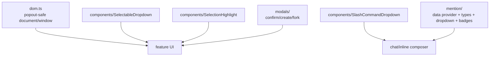

# `src/features/shared/` — Reusable UI primitives

Reusable UI helpers shared by chat, settings, and inline edit. May import from `src/pi/` for types and icon helpers. Prefer typed props/callbacks over direct plugin globals.

## Shared areas

## Rules

- Generic components should expose typed callbacks and cleanup methods.
- Modals should be promise-friendly when that keeps callers simple.
- Mention providers may cache, but must expose invalidation/dirty-marking hooks for vault changes.
- Follow Obsidian accessibility rules: keyboard navigation, ARIA labels, and visible focus states.
- Icon helpers (`pi/ui/icons.ts`) live in `pi/` since they depend on Pi-owned type definitions.
