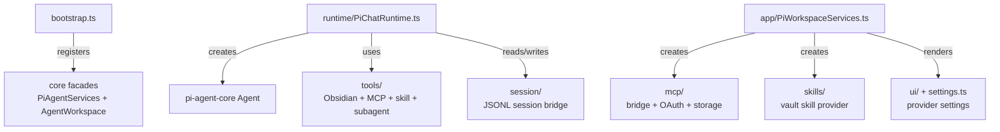

# `src/pi/` — Pi agent adaptor (`pi-agent-core`)

Pi adaptor implementation: in-process `Agent`, streaming runtime, settings, and workspace services. Wired into `PiAgentServices` / `AgentWorkspace` from `main.ts` at startup.

## Adapter map

## Key Files

- `bootstrap.ts` — `bootstrapPiAgent()` registers chat-facing services
- `app/PiWorkspaceServices.ts` — Workspace services (settings tab, command catalog hooks)
- `runtime/PiChatRuntime.ts` — Chat runtime using `pi-agent-core` / `pi-ai`
- `runtime/PiAgentEventAdapter.ts` — Stream chunk translation
- `ui/PiChatUIConfig.ts` — Model selector, reasoning controls, provider icon
- `settings.ts` — Pi agent settings persisted inside `ObsiusSettings.agentSettings`

## Patterns

- Depends only on `src/core/` ports — never on `src/features/`
- Bootstrap in `main.ts` calls `bootstrapPiAgent()` (installs workspace + agent registration)
- Obsidian-native tools prefer in-process `ObsidianVaultApi`; CLI transport is fallback or opt-in power surface
- MCP servers are exposed to the model through one proxy AgentTool named `mcp`
- Provider OAuth (`auth/`) and MCP OAuth (`mcp/oauth/`) are separate concerns
