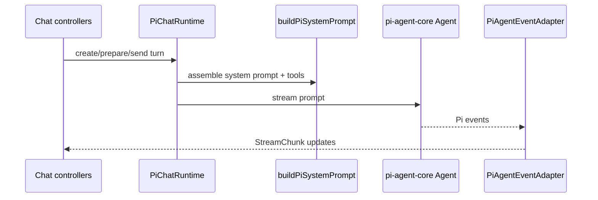

# `src/pi/runtime/` — Pi chat runtime and stream adapter

Concrete `ChatRuntime` implementation using `pi-agent-core` / `pi-ai`: system prompt assembly, model resolution, event adaptation, auxiliary queries, and message-content conversion.

## Runtime flow

## Rules

- Implement core runtime contracts without importing `src/features/**`.
- Keep system prompt assembly Pi-specific here; reusable prompt text remains in `src/core/prompt/`.
- Preserve streaming order and stale-callback guards when adapting Pi events.
- Map Pi SDK message/content shapes at the boundary before returning core types.
