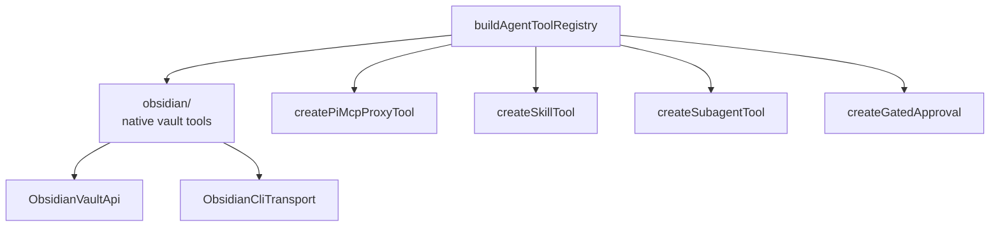

# `src/pi/tools/` — Pi AgentTool registry and Obsidian tools

Builds concrete Pi `AgentTool` implementations for Obsidian APIs, MCP proxy, skills, subagents, and approval gates.

## Tool map

## Rules

- Prefer in-process Obsidian Plugin API via `ObsidianVaultApi`; CLI is fallback/power-tool surface.
- Keep tool names aligned with `src/core/tools/` constants when UI/core classify output.
- Apply approval gates consistently for mutating or sensitive operations.
- Do not import feature UI; return structured results for runtime/renderers to interpret.
