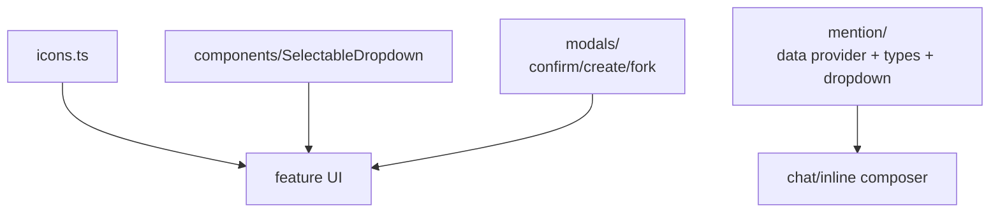

# `src/shared/` — Feature-agnostic UI primitives

Reusable UI helpers shared by chat, settings, and inline edit. Keep this layer generic: prefer typed props/callbacks over direct plugin globals or Pi service lookups.

## Shared areas

## Rules

- Generic components should expose typed callbacks and cleanup methods.
- Modals should be promise-friendly when that keeps callers simple.
- Mention providers may cache, but must expose invalidation/dirty-marking hooks for vault changes.
- Follow Obsidian accessibility rules: keyboard navigation, ARIA labels, and visible focus states.
