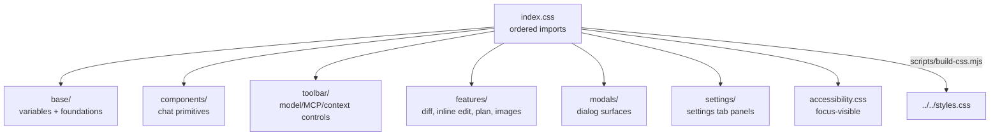

# `src/style/` — CSS source modules

All plugin CSS is built into root `styles.css` by `npm run build:css`. The build is manifest-driven: every CSS module must be imported from `index.css` in the intended order.

## CSS build graph

## Rules

- Use `.pivi-*` scoped selectors; avoid broad Obsidian/global selectors.
- Prefer Obsidian CSS variables and `--pivi-*` tokens over hardcoded colors.
- Keep focus-visible and keyboard accessibility visible; do not remove outlines without replacement.
- When adding a CSS file, add it to `index.css` or `npm run build:css` will fail.
