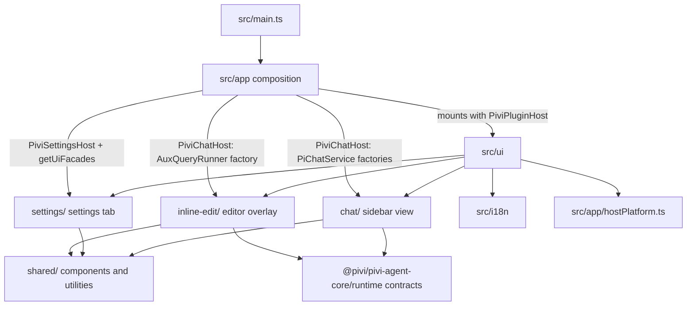

*This file extends the root [AGENTS.md](../../AGENTS.md). Follow root guidance first, then these local rules.*

# Product UI

## Purpose

`src/ui/` owns Pivi's Obsidian-facing product presentation: the sidebar chat, reusable UI primitives, settings tab, and inline-edit experience. It renders and coordinates user interactions but does not construct the Pi engine, concrete Obsidian host adapters, tools, or app workspace services.

## Architecture

`src/main.ts` and `src/app/` are the composition side of the boundary. App registration mounts UI with structural hosts from `src/app/hostContracts.ts`: `PiviChatHost` for chat and inline edit, `PiviSettingsHost` for settings sections, and full `PiviPluginHost` only where Obsidian's `PluginSettingTab` requires it.

The sidebar's `PiviView` owns view/tab chrome; tabs own transient `OpenSessionState`, controllers, renderers, and a lazily created `PiChatService`. Settings project engine-owned model/auth behavior through `getUiFacades()`. Inline edit wraps an injected `AuxQueryRunner` with `QueryBackedInlineEditService` and renders CodeMirror decorations in the active editor.

## Subdirectory map

| Path | Responsibility | Local guidance |
|---|---|---|
| `src/ui/chat/` | `PiviView`, tab/session lifecycle, composer/controllers, stream projection, message/tool rendering, context controls | `src/ui/chat/AGENTS.md` |
| `src/ui/shared/` | Cross-feature components, mentions, modals, DOM/editor/path helpers | `src/ui/shared/AGENTS.md` |
| `src/ui/settings/` | `PiviSettingTab`, tab renderers, model/provider, MCP, skills, tools, and product settings | `src/ui/settings/AGENTS.md` |
| `src/ui/inline-edit/` | CodeMirror inline-edit controller, diff/decorations, accept/reject lifecycle | `src/ui/inline-edit/AGENTS.md` |

Read the applicable child `AGENTS.md` before changing a subdirectory.

## Boundary rules

- Never import raw `@earendil-works/*` packages. Pi SDK use belongs under `packages/pivi-agent-core/src/engine/pi/`.
- Never import `@pivi/pivi-agent-core/engine/pi` or its subpaths. Obtain concrete behavior through `plugin.createChatService()`, `plugin.createAuxQueryRunner()`, and `plugin.getUiFacades()`.
- Never import `@pivi/obsidian-host` or its subpaths. Import platform/path/vault helpers and service-contract re-exports through `@/app/hostPlatform`.
- Never import `@pivi/obsidian-tools`; UI consumes Pivi tool contracts/display models, not concrete tool implementations.
- Never import `@/app/workspace` or its subpaths, including via relative paths. Reach workspace capabilities through narrow host methods and `getPiWorkspace()`.
- Prefer `PiviChatHost` or `PiviSettingsHost`; use `PiviPluginHost` only when an Obsidian base class requires the actual `Plugin` surface.
- UI may import host-neutral APIs from non-engine `@pivi/pivi-agent-core/*` subpaths and public Obsidian APIs. Keep app/UI composition one-way: app mounts UI; UI only type-depends on host contracts.

## Key conventions

- `src/ui/chat/tabs/tabRuntime.ts` is the sole UI creation point for chat services. Keep creation lazy and call `plugin.createChatService()`; never instantiate a runtime in UI.
- Use `PiChatService` for durable chat turn/session operations. Use a fresh injected `AuxQueryRunner` for short title, refine, or inline-edit queries that do not own a chat session lifecycle.
- Treat session files as durable identity and tab/controller/render state as rebuildable. Clean up services, subscriptions, event refs, managers, and CodeMirror decorations on close, replacement, hide, or failed initialization.
- Route model options, settings snapshots, custom-provider synchronization, model catalogs, and credential migration through `getUiFacades()` rather than duplicating engine policy.
- Put cross-feature primitives in `src/ui/shared/`; keep product behavior in the owning feature. Do not make shared helpers depend on chat/settings/inline-edit implementations.
- Use `PascalCase.ts` for primary UI classes/controllers/renderers/modals and `lowerCamelCase.ts` for helpers. Preserve existing import aliases and import sorting.
- Resolve document/window from the owning element (`getActiveDocument` / `getActiveWindow`) so pop-out windows work; avoid assuming global `window` or `document` for element-bound UI.

## i18n

- All user-visible copy—labels, descriptions, buttons, placeholders, Notices, empty states, aria labels, and tool display text—must use `t()` from `@/i18n`.
- Add keys to canonical `src/i18n/locales/en.json` and mirror the same key tree with translations in every other locale in the same change. Follow `src/i18n/AGENTS.md`.
- Use sentence case. Technical identifiers, model/provider/tool IDs, brand identifiers, and raw user/agent content are exceptions.
- Locale controls plugin chrome only; do not use it to force the agent's response language.

## Gotchas

- Obsidian views can open in pop-outs and third-party plugins can patch view lifecycle/DOM. Preserve `PiviView`'s Hover Editor guards and owner-document-aware event handling.
- Tabs can close during async service initialization. Re-check lifecycle state before publishing a service and clean up partially initialized subscriptions/services.
- Settings rendering is destructive (`containerEl.empty()`). Dispose MCP/slash managers before rerender/hide and preserve scroll when an action triggers redisplay.
- Inline edit is single-active-controller state. Reject/clean the previous controller, use the editor passed to `editorCallback`, and keep IME composition guards.
- Do not expose API-transformed MCP prompt text in visible history: users see `@server`; runtime prompt finalization may send `@server MCP`.
- Avoid new `!important` styles and hard-coded English. CSS lives in `src/styles/`, not beside these TypeScript modules.
