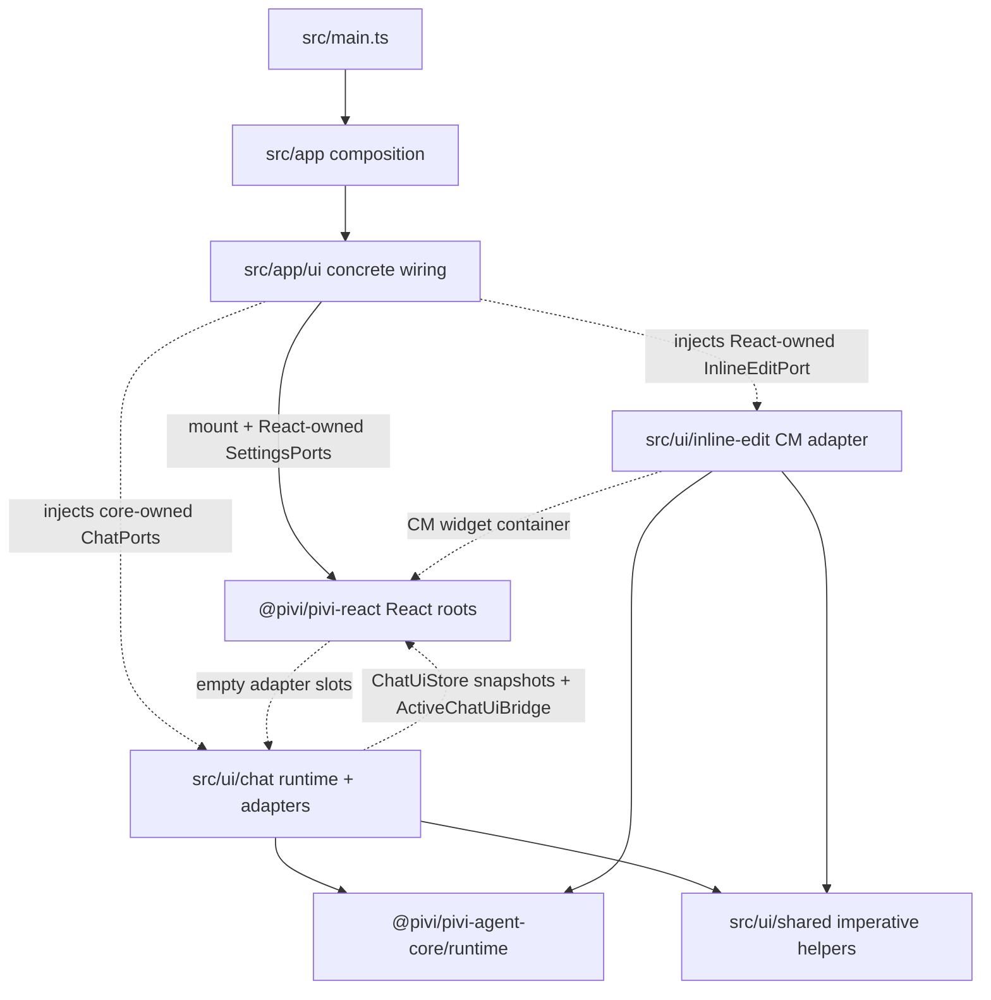

*This file extends the root [AGENTS.md](../../AGENTS.md). Follow root guidance first, then these local rules.*

# Product UI

## Purpose

`src/ui/` owns chat runtime orchestration, reusable imperative UI primitives, and inline-edit editor orchestration/selection bridging. The product-owned `@pivi/pivi-react` package owns product chrome plus inline-edit CodeMirror state/widget types and mount/dispose; Obsidian visual capabilities are injected by `src/app/ui`, while this layer keeps runtime coordination and adapters that require Obsidian editor context.

## Architecture

`src/main.ts` and `src/app/` compose Obsidian lifecycle shells and package-owned feature ports. `src/ui/` retains runtime orchestration and the imperative Obsidian/editor adapters that cannot live in the Obsidian-specific React presentation package.

`src/app/ui/PiviViewHost` owns the Obsidian view lifecycle and mounts the package React root. `createImperativeChatAdapter` owns aggregate mount/lifecycle and semantic translation; `src/ui/chat` owns tab runtime orchestration and imperative message-presentation implementations. Chat product chrome is React-owned; `src/ui/chat` retains service orchestration and explicit content adapters only—never import `@/app/ui/**` from here. React settings live entirely in `@pivi/pivi-react` and consume React-owned `SettingsPorts` implemented by app wiring. Inline edit is a React-owned CodeMirror widget backed by an injected `AuxQueryRunner`.

## Subdirectory map

| Path | Responsibility | Local guidance |
|---|---|---|
| `src/ui/chat/` | Tab/session lifecycle, service orchestration, stream projection, and imperative Markdown/tool content adapters beneath the React shell | `src/ui/chat/AGENTS.md` |
| `src/ui/shared/` | Cross-feature imperative Obsidian/CodeMirror adapters and path helpers | `src/ui/shared/AGENTS.md` |
| `src/ui/inline-edit/` | App-side CodeMirror/Obsidian adapter for the package React inline-edit widget | `src/ui/inline-edit/AGENTS.md` |

Read the applicable child `AGENTS.md` before changing a subdirectory.

## Boundary rules

- Never import raw `@earendil-works/*` packages. Pi SDK use belongs under `packages/pivi-agent-core/src/engine/pi/`.
- Never import `@pivi/pivi-agent-core/engine/pi` or its subpaths. Obtain concrete behavior through injected core-owned `ChatPorts`, `PiChatService`, and `AuxQueryRunner` contracts. `src/ui/**` must never call `getUiFacades()`, `getPiWorkspace()`, `saveSettings()`, or `getAllViews()`.
- Never import `@pivi/obsidian-host` or its subpaths. Use `@/app/hostPlatform` for Pivi-owned host/path/vault helpers and service-contract re-exports; keep direct Node `fs`/`os`/`path` use limited to imperative filesystem/path adapters.
- Never import `@pivi/obsidian-tools`; UI consumes Pivi tool contracts/display models, not concrete tool implementations.
- Never import `@/app/workspace` or its subpaths, including via relative paths. Chat runtime/session/model/catalog/settings capabilities arrive through `ChatPorts` injected into `TabManager`; do not reach back into composition hosts for them.
- Never import `@/app/ui` or its subpaths from `src/ui/**`. App composition mounts React and creates adapters; this layer is imperative adapters + runtime orchestration only. Import application-facing `ChatPorts` from `@pivi/pivi-agent-core/runtime/chatPorts`, never from the React package.
- Import `@pivi/pivi-react` only through the exact `store`, `inline-edit`, or `context-badges` presentation subpath. Root-barrel, `mount`, `ports`, deep-internal, and relative-path package imports are forbidden; pure parsing, matching, markdown transforms, and usage projection come from core domain subpaths.
- `PiviChatHost` intentionally contains only `app`. Never type product UI against `PiviChatCompositionHost`, `PiviSettingsHost`, or `PiviPluginHost`; those wide contracts belong to app composition.
- UI may import host-neutral APIs from non-engine `@pivi/pivi-agent-core/*` subpaths, public Obsidian APIs, narrowly scoped Node platform modules required by imperative adapters, the three approved React presentation subpaths, `@/app/i18n`, and `@/app/hostPlatform`; host-contract imports remain type-only. Keep app/UI composition one-way: app mounts UI and owns concrete wiring; UI never imports app workspace or app UI implementations.

## Key conventions

- `src/ui/chat/tabs/tabRuntime.ts` is the sole UI creation point for chat services. Keep creation lazy and call `ports.runtime.createChatService()`; never instantiate a runtime or obtain its factory from the host in UI.
- Use `PiChatService` for durable chat turn/session operations. Use a fresh injected `AuxQueryRunner` for short title, refine, or inline-edit queries that do not own a chat session lifecycle.
- Treat session files as durable identity and tab/controller/render state as rebuildable. Clean up services, subscriptions, event refs, managers, and CodeMirror decorations on close, replacement, hide, or failed initialization.
- Consume model options/readiness/configuration through `ChatPorts.models` and projected settings through `ChatPorts.settings`. Facades, custom-provider synchronization, credential migration, and engine policy adaptation remain in app composition.
- Put cross-feature primitives in `src/ui/shared/`; keep product behavior in the owning feature. Do not make shared helpers depend on chat/settings/inline-edit implementations.
- Use `PascalCase.ts` for primary UI classes/controllers/renderers/modals and `lowerCamelCase.ts` for helpers. Preserve existing import aliases and import sorting.
- Resolve document/window from the owning element (`getActiveDocument` / `getActiveWindow`) so pop-out windows work; avoid assuming global `window` or `document` for element-bound UI.

## i18n

- All user-visible copy—labels, descriptions, buttons, placeholders, Notices, empty states, aria labels, and tool display text—must use the shared `t()` from `@/app/i18n` for imperative adapters; React surfaces use `useT()` under `I18nProvider`.
- Add keys to canonical `packages/pivi-react/src/i18n/locales/en.json` and mirror the same key tree with translations in every other locale in the same change. Follow the package i18n guidance.
- Use sentence case. Technical identifiers, model/provider/tool IDs, brand identifiers, and raw user/agent content are exceptions.
- Locale controls plugin chrome only; do not use it to force the agent's response language.

## Gotchas

- Obsidian views can open in pop-outs and third-party plugins can patch view lifecycle/DOM. Preserve `PiviViewHost`'s Hover Editor guards, stable input-tab portal, and owner-document-aware event handling.
- Tabs can close during async service initialization. Re-check lifecycle state before publishing a service and clean up partially initialized subscriptions/services.
- Settings presentation is fully React-owned in `@pivi/pivi-react`; do not reintroduce imperative settings managers under `src/ui/`.
- Inline edit is single-active-controller state. Reject/clean the previous controller, use the editor passed to `editorCallback`, and keep IME composition guards.
- Do not expose API-transformed MCP prompt text in visible history: users see `/server` or `/server/tool`; runtime prompt finalization may append ` MCP` only in the API prompt.
- Avoid new `!important` styles and hard-coded English. CSS lives in `packages/pivi-react/styles/`, not beside these TypeScript modules.
