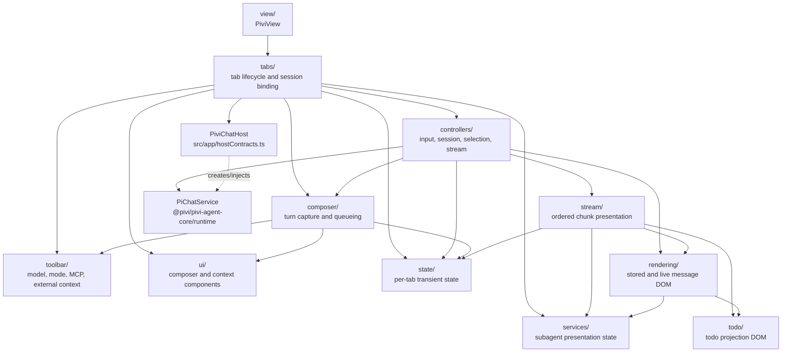

*This file extends the root [AGENTS.md](../../../AGENTS.md). Follow root guidance first, then these local rules.*

# Chat UI subsystem

## Purpose

`src/ui/chat/` implements Pivi's multi-tab Obsidian sidebar chat: view lifecycle, session binding, turn composition, streaming presentation, message/tool rendering, and per-tab UI state.

This layer is product UI and orchestration. It consumes injected host and runtime contracts; it does not construct the Pi engine, own durable session storage, or implement tools.

## Architecture

### Lifecycle and data flow

1. `PiviView.onOpen()` builds the chat shell, creates `TabManager`, restores persisted tab bindings or creates a blank tab, then primes eligible runtime state.
2. `TabManager` creates each `TabData`, initializes its DOM, toolbar, context managers, controllers, and renderer, and activates only the selected tab's DOM.
3. A new tab begins as `blank`: it has draft UI settings but no durable open-session binding and no chat service.
4. Loading history produces a `bound_cold` tab associated with `openSessionId` and `sessionFile`; runtime work remains lazy.
5. The first send calls `initializeTabService()`. This is the only UI location that calls `plugin.createChatService()`. It passively syncs the session and moves the tab to `bound_active`; `query()` starts actual work.
6. `InputController` delegates turn capture to composer helpers, streams `PiChatService.query()` chunks through `StreamController`, finalizes the turn, saves session projection, and processes any queued turn.
7. `StreamController` serially dispatches chunks to specialized presenters. Presenters update `ChatState`, message content blocks/tool calls, and live DOM through rendering helpers.
8. `PiviView.onClose()` persists tab state before `TabManager.destroy()` saves/cleans tabs, subscriptions, controllers, services, and DOM listeners.

## Subdirectory map

| Directory | Responsibility | Local guidance |
|---|---|---|
| `src/ui/chat/view/` | Obsidian `ItemView` shell, view open/close lifecycle, header/layout, event registration, and tab-state persistence. | — |
| `src/ui/chat/tabs/` | Per-tab construction, activation, archive/close behavior, persisted restoration, session opening, lazy runtime creation, fork/redo, and wiring of controllers/toolbars/context. | — |
| `src/ui/chat/controllers/` | Stateful coordinators for input, session projection, stream dispatch, selections, keyboard navigation, provider boundaries, and title generation. | — |
| `src/ui/chat/composer/` | Provider-neutral turn request construction, outgoing-turn setup/finalization, one-turn queueing/restoration, inline prompts, and response duration. | — |
| `src/ui/chat/stream/` | Chunk-to-state/DOM presentation for text, thinking, tools, usage, todos, subagents, scrolling, and vault-change notifications. | — |
| `src/ui/chat/rendering/` | Live and stored assistant/user rendering, Markdown, tool displays, diffs, thinking, ask-user prompts, write/edit blocks, and subagents. | `src/ui/chat/rendering/AGENTS.md` |
| `src/ui/chat/toolbar/` | Model, mode, reasoning, MCP, external-context, and context-usage controls. | — |
| `src/ui/chat/ui/` | Rich input, file/image/inline context, send button, navigation sidebar, status panel, and textarea sizing. `src/ui/chat/ui/file-context/` has its own `AGENTS.md`. | `src/ui/chat/ui/file-context/AGENTS.md` |
| `src/ui/chat/services/` | UI-side synchronous/background subagent lifecycle tracking and tolerant result parsing. | — |
| `src/ui/chat/todo/` | Pure DOM projection of the core-owned `TodoVisualizationModel`. | — |
| `src/ui/chat/state/` | Per-tab transient chat and streaming state, callbacks, maps, timers, and queued-turn shape. | — |
| `src/ui/chat/utils/` | Small chat-only calculations such as usage percentage/model-window recalculation. | — |
| Top-level | Shared branch/fork/redo entry-ID helpers and chat constants. | — |

## Key files

| File | Role |
|---|---|
| `src/ui/chat/view/PiviView.ts` | Main Obsidian chat view; composes and tears down `TabManager`, persists view tab state, and coordinates vault/workspace events. |
| `src/ui/chat/tabs/TabManager.ts` | Owns the tab collection, active tab, create/switch/archive/close/restore flows, cross-view session opening, forks, and persistence projection. |
| `src/ui/chat/tabs/Tab.ts` | Creates one `TabData` graph and its DOM; activates, deactivates, and destroys per-tab resources. |
| `src/ui/chat/tabs/types.ts` | Canonical tab aggregate, lifecycle states, UI/controller/service slots, and persisted tab binding shape. |
| `src/ui/chat/tabs/tabControllerInit.ts` | Composition point for per-tab renderer and controllers; connects callbacks without importing `PiviView`. |
| `src/ui/chat/tabs/tabRuntime.ts` | Sole UI factory call for `PiChatService`; session sync, subscriptions, lazy activation, and failed/closing initialization cleanup. |
| `src/ui/chat/tabs/tabToolbarInit.ts` | Creates toolbar/context/send controls and maps changes to draft or bound-tab settings. |
| `src/ui/chat/tabs/tabFork.ts` | Resolves durable entry IDs and requests a new session fork from the host. |
| `src/ui/chat/controllers/InputController.ts` | Public per-tab input coordinator; delegates turn pipeline, queue restoration, provider boundaries, cancellation, and inline questions. |
| `src/ui/chat/controllers/inputTurnPipeline.ts` | Executes the send/query/finalize sequence and guards against stale stream generations. |
| `src/ui/chat/controllers/SessionController.ts` | Hydrates and saves `OpenSessionState`, resets blank sessions, synchronizes session-scoped UI, and clears transient stream state. |
| `src/ui/chat/controllers/StreamController.ts` | Ordered chunk dispatcher and boundary coordinator for text, thinking, tools, subagents, usage, errors, and completion. |
| `src/ui/chat/composer/ComposerSubmission.ts` | Builds visible text plus a provider-neutral `ChatTurnRequest` from files, selections, images, inline context, MCP, and external paths. |
| `src/ui/chat/composer/ComposerTurnLifecycle.ts` | Captures turn state and creates user/assistant message placeholders before streaming. |
| `src/ui/chat/stream/StreamEventReducer.ts` | Canonical merge/register/status operations for streamed tool calls. |
| `src/ui/chat/stream/StreamRenderQueue.ts` | RAF-throttled rendering with explicit flush/cancel behavior. |
| `src/ui/chat/rendering/MessageRenderer.ts` | Entry point for live/stored message DOM and Obsidian Markdown rendering. |
| `src/ui/chat/state/ChatState.ts` | Mutable transient state for one tab, including stream generation and live DOM references. |
| `src/ui/chat/services/SubagentManager.ts` | Correlates task, child-tool, agent-output, and asynchronous completion events with rendered subagent state. |
| `src/ui/chat/toolbar/InputToolbar.ts` | Creates the toolbar control set and returns components for tab wiring. |
| `src/ui/chat/ui/RichChatInput.ts` | Contenteditable composer with textarea-compatible API, mention badges, plain-text paste, and IME-safe synchronization. |

## Patterns and constraints

### Boundaries

- UI chat code depends on the narrow `PiviChatHost` contract from `src/app/hostContracts.ts`, not the concrete plugin class, `PiviView`, or app workspace implementations.
- Depend on `PiChatService` from `@pivi/pivi-agent-core/runtime`. Never import, instantiate, or type against `PiChatRuntime`.
- Do not import `@pivi/pivi-agent-core/engine/pi`, raw `@earendil-works/*` SDK modules, `src/app/workspace/**`, or `@pivi/obsidian-host/**` from this directory.
- Host/platform operations must arrive through `PiviChatHost`, narrow structural callbacks, or approved UI adapters such as `src/app/hostPlatform.ts`.
- Use core-owned message, turn, tool, session, todo, context, and usage models. Do not duplicate provider/runtime protocols in UI.
- Keep `src/app/hostContracts.ts` structural and UI-neutral. Use interfaces such as `TabManagerViewHost` to prevent app↔UI and view↔tab cycles.
- Runtime state is rebuildable. Durable identity belongs to the session file/header; chat DOM and `OpenSessionState` are projections.

### Tabs and sessions

- Preserve the lifecycle transitions `blank` → `bound_cold` → `bound_active` → `closing`.
- Blank tabs may carry `draftModel` and `draftTitle`; do not create empty sessions merely by opening a tab.
- `tab.id`, `openSessionId`, runtime session ID, JSONL header ID, `sessionFile`, and legacy `leafId` are distinct identifiers.
- Persist tab binding with `sessionFile` plus draft UI state. Do not treat `openSessionId`, tab ID, runtime ID, or `leafId` as durable session identity.
- Session switching must save current state, dismiss inline prompts, orphan/clear active subagents, reset queued/transient UI, sync the service, and re-render stored messages.
- Archiving hides a tab without destroying its runtime/session state. Closing destroys it. Do not collapse these behaviors.
- Fork and redo operations require persisted user/assistant entry IDs. Preserve `userMessageId`, `assistantMessageId`, and `parentEntryId` through rendering and hydration.

### Controllers, streaming, and rendering

- Keep controllers as orchestration layers. Put turn capture in `composer/`, chunk-specific presentation in `stream/`, and DOM formatting in `rendering/`.
- Consume `PiChatService.query()` with `for await` and await chunk handling in arrival order.
- Check `ChatState.streamGeneration` after asynchronous boundaries. A reset, forced new session, or close invalidates the old stream even if chunks still arrive.
- Finalize or flush the active text/thinking/tool block before changing content type. `contentBlocks` preserve stored assistant ordering; `toolCalls` alone do not.
- Streaming `tool_use` chunks may repeat with partial input. Merge by tool ID; do not create duplicate tool calls or reorder their content blocks.
- Tool results may arrive after deferred rendering or with imperfect error flags. Resolve against the existing tool ID and prefer structured result metadata where available.
- Flush `StreamRenderQueue` before finalizing a block; cancel queued animation frames during teardown.
- Stored-history rendering and live streaming must converge on the same `ChatMessage`/`contentBlocks` representation.
- Keep Obsidian Markdown rendering asynchronous and guard stale render generations where a newer update can replace an older render.

### Composer and toolbar

- Build `ChatTurnRequest` at send time from current UI capability selections. Visible `displayContent` and runtime/persisted prompt content are intentionally different.
- MCP mentions, attached files, inline references, editor/browser/canvas selections, images, and external roots belong in the turn request—not ad hoc prompt strings in controllers.
- Queued submissions are snapshots of turn content/context, but MCP and external-context permissions are refreshed from current UI when the queued turn executes.
- Only one queued turn is maintained; additional submissions merge through the core queue helpers.
- Preserve IME composition guards in `RichChatInput`; rebuilding mention badges during composition breaks CJK input.
- Model changes on blank tabs update draft state. Bound-tab model/mode/reasoning changes update that tab's runtime settings and capability gating.
- MCP and external-context selections are session/turn capabilities. Reset session-only selections on new/load flows; synchronize pinned external roots across all views.
- All user-visible labels, notices, placeholders, status text, and accessibility text must use `src/i18n/`.

### Ownership and cleanup

- Every tab owns its controllers, renderer, state, subagent manager, UI components, service, subscriptions, and event cleanup callbacks.
- Register manual DOM listeners in `tab.dom.eventCleanups` or an Obsidian `Component`; remove vault event refs and timers on destroy.
- Do not retain tab DOM references after close. Cleanup must tolerate partially initialized tabs and repeated calls.
- `services/` manages presentation correlation only; it must not execute subagents or become a second runtime.
- Render todo state from `TodoVisualizationModel`; do not parse raw `TodoWrite` payloads independently in `todo/`.

## Gotchas

- **Tab binding is not session identity.** A restored tab can be cold, an open-session ID is in-memory, and `leafId` is legacy compatibility. Use `sessionFile` for durable binding.
- **First send is a binding boundary.** Service initialization can race tab closure; re-check `closing` after asynchronous work and clean up an uncommitted service.
- **Session sync is passive.** `syncSession()` updates runtime context; it must not eagerly start agent work. `query()` starts the turn.
- **Chunk ordering is semantic.** Text, thinking, tools, compact boundaries, and subagents must be finalized in arrival order or stored history will render differently from the live turn.
- **Streaming tool input is incremental.** Empty or partial repeated `tool_use` chunks are normal.
- **Provider message boundaries can replace the assistant placeholder.** Route them through `InputProviderBoundaryHandler` before ordinary stream rendering.
- **Background subagent chunks may outlive the foreground turn.** Correlate by task/agent/tool IDs, persist terminal state when appropriate, and orphan unresolved work during session reset.
- **Cancellation is cooperative.** Set `cancelRequested`, invalidate stream generation when resetting, restore queued composer content, and call `PiChatService.cancel()`.
- **Async Markdown can finish late.** Use render-generation or element-identity checks and never let stale work overwrite a newer block.
- **Auto-scroll is user-sensitive.** Scrolling away disables it; only re-enable near the bottom after the existing delay.
- **Current-note attachment is session-aware.** It is automatically attached before a session starts but should not be resent every turn.
- **Forking while streaming is unsafe.** Fork only from stable messages with durable entry IDs.
