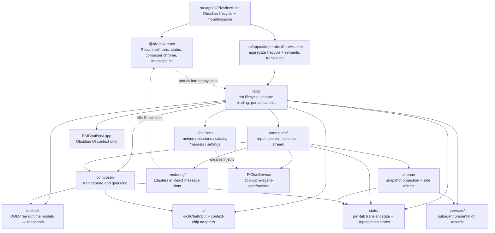

*This file extends the root [AGENTS.md](../../../AGENTS.md). Follow root guidance first, then these local rules.*

# Chat UI subsystem

## Purpose

`src/ui/chat/` owns chat **runtime orchestration** and **explicit imperative adapters** under the React shell: session binding, turn composition, chrome projection into `ChatUiStore`, message projection into `ChatProjectionStore`, and Markdown/tool/diff/ask-user/subagent bodies mounted into empty React slots. Obsidian view lifecycle lives in `src/app/ui/PiviViewHost.ts`; the `imperativeChat*.ts` adapter family owns aggregate mount/lifecycle and semantic translation; React shell/tabs/status/composer chrome/messages live in `@pivi/pivi-react`.

This layer consumes injected host and runtime contracts; it does not construct the Pi engine, own durable session storage, implement tools, or own migrated product chrome.

## Architecture

### Lifecycle and data flow

1. `PiviViewHost.onOpen()` creates core-owned `ChatPorts` via `createChatUiPorts`, prepares the React shell through `createImperativeChatAdapter`, and mounts one React shell via `mountChatView`. An app-owned adapter closure captures the ports and passes them directly to `TabManager`; the React mount contract never receives them, and `ChatShell` consumes snapshots/actions only.
2. `ImperativeChatAdapter.mount` constructs `TabManager` with the same `ChatPorts`, loads persisted tab bindings or creates a blank tab, and primes eligible runtime state. `TabManager` creates each `TabData`, initializes its controller/UI/state graph plus the uncontrolled rich-input and empty portal slots (`tabDom`), and activates only the selected tab; blank and cold tabs still create no chat service. Live chrome and message entities reach React through `ActiveChatUiBridge` plus immutable `ChatUiStore` and `ChatProjectionStore` snapshots; `scheduleTabsSnapshotPublish` keeps the separate tab strip store in sync. Ports supply catalogs/factories/model behavior/projected settings (`catalog` / `models` / `settings` / `runtime` / `sessions`), not live UI state or facade objects. There is no composer `McpServerSelector`, no `navRowEl`, and no DOM-mutating stream path.
3. A new tab begins as `blank`: it has draft UI settings but no durable open-session binding and no chat service.
4. Loading history produces a `bound_cold` tab associated with `openSessionId` and `sessionFile`; runtime work remains lazy.
5. The first send calls `initializeTabService()`. This is the only UI location that calls `ports.runtime.createChatService()`. It passively syncs the session and moves the tab to `bound_active`; `query()` starts actual work.
6. `InputController` delegates turn capture to composer helpers, streams `PiChatService.query()` chunks through `StreamController`, finalizes the turn, saves session projection, and processes any queued turn.
7. `SessionController` hydrates the newest bounded JSONL message page through `ChatPorts.sessions` and requests older stable-ID pages when React reaches the top. It rejects late pages after session changes or tab disposal. `StreamController` serially reduces chunks into durable `ChatMessage` state and performs non-DOM service effects; background Agent chunks serialize through a per-tab Promise tail before projection sequencing. `ChatState` owns projection scope/binding metadata and the monotonic sequence, then emits every mutation through `ChatProjectionStore.dispatch()`. Durable state changes immediately; active visible projection coalesces by owner-window animation frame, hidden/inactive projection uses the owner-window 250 ms cadence, and terminal/error/cancel/save/switch/close boundaries flush synchronously. `ChatUiStore` no longer contains messages. Only explicit Markdown/tool/diff/ask-user/subagent slots invoke imperative adapters.
8. `PiviViewHost.onClose()` first asks the semantic view handle to persist tab state, then disposes the imperative adapter and React root. Adapter disposal calls `TabManager.destroy()` to clean tabs, subscriptions, controllers, services, and DOM listeners; persistence is a host-lifecycle operation, not an implicit side effect of adapter disposal.

## Subdirectory map

| Directory | Responsibility | Local guidance |
|---|---|---|
| `src/ui/chat/tabs/` | Per-tab construction, activation, archive/close behavior, persisted restoration, session opening, lazy runtime creation, fork/redo, portal slot scaffolding, and wiring of controllers/context. | — |
| `src/ui/chat/controllers/` | Stateful coordinators for input, session projection, stream dispatch, selections, keyboard navigation, provider boundaries, title generation, and welcome quote background. | — |
| `src/ui/chat/composer/` | Provider-neutral turn request construction, outgoing-turn setup/finalization, one-turn queueing/restoration, inline prompts, response duration, and pure ordered-Markdown-list continuation edits. | — |
| `src/ui/chat/stream/` | Chunk-to-state projection for text, thinking, tools, usage, todos, subagents, scrolling, and vault-change notifications. No message DOM; React consumes chrome state from `ChatUiStore` and message entities from `ChatProjectionStore`. | — |
| `src/ui/chat/rendering/` | Imperative adapter slots for Obsidian Markdown, rich tool bodies, diffs, ask-user prompts, write/edit blocks, and stored nested subagents inside React message shells. | `src/ui/chat/rendering/AGENTS.md` |
| `src/ui/chat/toolbar/` | DOM-free external-context runtime model plus toolbar callback types; React owns presentation. MCP availability is settings-owned (no composer toolbar picker). | — |
| `src/ui/chat/ui/` | Imperative adapters for uncontrolled rich input, file/image/inline context chips, and textarea sizing. `src/ui/chat/ui/file-context/` has its own `AGENTS.md`. | `src/ui/chat/ui/file-context/AGENTS.md` |
| `src/ui/chat/services/` | UI-side synchronous/background subagent lifecycle tracking and tolerant result parsing. `SubagentManager` stays a pure record layer; `stream/streamSubagentLifecycle.ts` owns stream-event correlation, retry/hydrate timing, and message projection because it depends on `ChatState`, `PiChatService`, and imperative render timing. See **Subagent stream boundary** below. | — |
| `src/ui/chat/state/` | Per-tab transient chat and streaming state, callbacks, maps, timers, queued-turn shape, and immutable React-store projection. | — |
| Top-level | Shared branch/fork/redo entry-ID helpers and chat constants. | — |

## Key files

| File | Role |
|---|---|
| `src/app/ui/PiviViewHost.ts` | Thin app-owned Obsidian view lifecycle; mounts/disposes React shell, persists tab state, and coordinates vault/workspace events. |
| `src/app/ui/imperativeChatAdapter.ts` | Aggregate orchestrator: mounts `TabManager`, delegates semantic handle/message presentation to sibling adapters, and bridges the tabs store. |
| `src/app/ui/imperativeChatViewHandle.ts` | Constructs the semantic `PiviChatViewHandle` commands and maintenance operations. |
| `src/app/ui/createSubagentContentAdapter.ts` | App-owned React `MessageContentAdapter` bridge for stored subagent mount/update; preserves the mounted adapter across incremental stream changes. |
| `packages/pivi-react/src/mount/ChatShell.tsx` | React-owned header, logo, tabs, welcome/quote adapter slot, queue, composer toolbar (including input usage meter), todo status, navigation, auto-scroll status, and owner-realm interactions. Consumes snapshots/actions, not application runtime ports. |
| `packages/pivi-react/src/mount/activeChatUiBridge.ts` | Runtime-only active-tab selector connecting immutable stores and React-exclusive portal elements without placing DOM in snapshots. |
| `src/ui/chat/tabs/Tab.ts` | Creates one `TabData` graph and its portal/input scaffolds; activates, deactivates, and destroys per-tab resources. |
| `src/ui/chat/tabs/types.ts` | Canonical tab aggregate, lifecycle states, UI/controller/service slots, and persisted tab binding shape. |
| `src/ui/chat/tabs/tabControllerInit.ts` | Composition point for per-tab renderer and controllers; connects callbacks without importing `PiviViewHost`. |
| `src/ui/chat/tabs/tabRuntime.ts` | Sole UI factory call for `PiChatService`; session sync, subscriptions, lazy activation, and failed/closing initialization cleanup. |
| `src/ui/chat/tabs/tabExternalContext.ts` | Synchronizes runtime sessions with effective external roots; runtime restarts preserve current tab choices while session changes reset them to pinned device-local defaults. |
| `src/ui/chat/tabs/tabMessageViewport.ts` | Popout-safe message viewport wiring; observes both the scroll viewport and React message portal so asynchronous layout growth preserves opted-in auto-scroll and navigation state. |
| `src/ui/chat/tabs/tabToolbarInit.ts` | `wireComposerChrome()` adapts model/mode/reasoning, external-context, and send/cancel runtime behavior into serializable composer snapshots and narrow React actions. Model changes refresh the usage context window immediately after settings persistence and again after model metadata preparation. No MCP toolbar picker or subagent activity shelf. |
| `src/ui/chat/tabs/tabFork.ts` | Resolves durable entry IDs and requests a new session fork through `ChatPorts.sessions`. |
| `src/ui/chat/controllers/InputController.ts` | Public per-tab input coordinator; delegates turn pipeline, queue restoration, provider boundaries, cancellation, and inline questions. |
| `src/ui/chat/controllers/inputTurnPipeline.ts` | Executes the send/query/finalize sequence and guards against stale stream generations. |
| `src/ui/chat/controllers/SessionController.ts` | Hydrates and saves `OpenSessionState`, resets blank sessions, synchronizes session-scoped UI, and clears transient stream state. |
| `src/ui/chat/controllers/StreamController.ts` | Ordered chunk reducer/service-effect coordinator for tools, subagents, usage, errors, and completion; it owns no message DOM. |
| `src/ui/chat/composer/ComposerSubmission.ts` | Builds visible text plus a provider-neutral `ChatTurnRequest` from files, selections, images, inline context, MCP, and external paths. |
| `src/ui/chat/composer/ComposerTurnLifecycle.ts` | Captures turn state and creates user/assistant message placeholders before streaming. |
| `src/ui/chat/stream/StreamEventReducer.ts` | Canonical merge/register/status operations for streamed tool calls. |
| `src/ui/chat/rendering/MessageRenderer.ts` | Obsidian Markdown/user-content adapter host; React owns message shells and transcript scrolling. |
| `src/ui/chat/state/ChatState.ts` | Mutable transient state plus immutable React snapshot publication; runtime state contains no message DOM. |
| `src/ui/chat/services/SubagentManager.ts` | Correlates task, child-tool, agent-output, and asynchronous completion events into pure subagent records. |
| `src/ui/chat/stream/streamSubagentLifecycle.ts` | UI stream coordinator for subagent tool_use/result/retry/hydrate. Depends on `ChatState`, scroll/thinking callbacks, and `window.setTimeout` — keep in `src/ui/chat/stream/`. Do not sink into core `SubagentManager` / engine jobs without first extracting a host-neutral pure reducer; engine already owns concurrency (`subagentConcurrencyLimiter`) and background jobs (`piBackgroundSubagentJobs`). |
| `src/ui/chat/ui/RichChatInput.ts` | Uncontrolled contenteditable adapter with textarea-compatible API, mention badges, plain-text paste, ordered-list continuation, and IME-safe synchronization. React never owns its children. |

## Patterns and constraints

### Boundaries

- UI chat code depends on the `app`-only `PiviChatHost` contract from `src/app/hostContracts.ts`, not `PiviChatCompositionHost`, the concrete plugin class, `PiviViewHost`, or app workspace implementations. Do not import `@/app/ui/**` from this directory.
- Depend on `PiChatService` from `@pivi/pivi-agent-core/runtime`. Never import, instantiate, or type against `PiChatRuntime`.
- Consume injected `ChatPorts` (`runtime` / `sessions` / `catalog` / `models` / `settings`) via `TabManager` and type-import them from `@pivi/pivi-agent-core/runtime/chatPorts`; all chat settings reads go through the explicit `ChatSettingsSnapshot` projection, never `plugin.settings`, `PiviSettings`, or an `agentSettings` bag. Never import React-owned presentation ports or `@pivi/pivi-react/mount`, never implement application ports here, never call `getPiWorkspace()`, `getUiFacades()`, `saveSettings()`, or `getAllViews()`, and never cast host objects `as ChatPorts`.
- `TabManager` also receives the presentation-owned `ChatPerfRecorder` contract from app composition and passes it unchanged into each `ChatState` projection store. Chat runtime may emit through that seam but must not start/stop tracing, write trace files, create observers, or inspect the concrete app recorder.
- Projection sequence ownership stays in `ChatState`, never in React. A first turn may have null session/open-session identity, so `projectionScopeId` owns that pre-binding epoch; changing the durable binding resets the sequence. Capture a background Agent's parent projection run when its state is first registered and reuse it across later turns. Raw `done`/`error` chunks do not seal a run because final footer/service effects follow them. Emit `run.terminal` only after the final main/child mutation; use `projection.flush` for urgent non-sealing publication. On tab teardown, unsubscribe service callbacks before disposing `StreamController`; its disposal guard must prevent queued or await-resumed background work from publishing.
- Do not import `@pivi/pivi-agent-core/engine/pi`, raw `@earendil-works/*` SDK modules, `src/app/workspace/**`, or `@pivi/obsidian-host/**` from this directory.
- Obsidian UI context may arrive through `PiviChatHost.app`; runtime/session/model/catalog/settings capabilities must arrive through `ChatPorts`. Other host/platform operations use narrow structural callbacks or approved adapters such as `src/app/hostPlatform.ts`.
- Use core-owned message, turn, tool, session, todo, context, and usage models. Do not duplicate provider/runtime protocols in UI.
- Keep `src/app/hostContracts.ts` structural and UI-neutral. App callers use `PiviChatViewHandle.commands` / `.maintenance`; they must never receive the internal `TabManager`, `TabData`, controller, UI, or DOM graph. `ImperativeChatAdapter` is the only boundary allowed to translate semantic view operations onto that aggregate. Use interfaces such as `TabManagerViewHost` to prevent app↔UI and view↔tab cycles.
- Runtime state is rebuildable. Durable identity belongs to the session file/header; open-session projections and adapter DOM are rebuildable.

### Tabs and sessions

- Preserve the lifecycle transitions `blank` → `bound_cold` → `bound_active` → `closing`.
- Blank tabs may carry `draftModel` and `draftTitle`; do not create empty sessions merely by opening a tab.
- `tab.id`, `openSessionId`, runtime session ID, JSONL header ID, `sessionFile`, and legacy `leafId` are distinct identifiers.
- Persist tab binding with `sessionFile` plus draft UI state. Do not treat `openSessionId`, tab ID, runtime ID, or `leafId` as durable session identity.
- Bound-session titles are durable JSONL session metadata. A restored tab resolves its title from the session store; do not copy titles into tab bindings or plugin data as a second source of truth.
- Session switching must save current state, dismiss inline prompts, orphan/clear active subagents, reset queued/transient UI, sync the service, and re-publish stored messages into the React snapshot.
- Archiving hides a tab without destroying its runtime/session state. Closing destroys it. Do not collapse these behaviors.
- Fork and redo operations require persisted user/assistant entry IDs. Preserve `userMessageId`, `assistantMessageId`, and `parentEntryId` through rendering and hydration.

### Controllers, streaming, and rendering

- Keep controllers as orchestration layers. Put turn capture in `composer/`, pure chunk/model operations in `stream/`, and explicit owner-realm adapters in `rendering/`.
- Consume `PiChatService.query()` with `for await` and await chunk handling in arrival order.
- Check `ChatState.streamGeneration` after asynchronous boundaries. A reset, forced new session, or close invalidates the old stream even if chunks still arrive.
- Reduce each chunk into the authoritative `ChatMessage` before service effects, then publish the post-effect message snapshot.
- Streaming `tool_use` chunks may repeat with partial input. Merge by tool ID; do not create duplicate tool calls or reorder their content blocks.
- Tool results may arrive with imperfect error flags. Resolve against the existing tool ID and prefer structured result metadata where available.
- Stored-history and live streaming must converge on the same `ChatMessage`/`contentBlocks` representation.
- Keep Obsidian Markdown adapters asynchronous and generation-guarded so a stale completion cannot replace a newer React slot.

### Composer and toolbar

- Build `ChatTurnRequest` at send time from current UI capability selections. Visible `displayContent` and runtime/persisted prompt content are intentionally different.
- Workspace command tokens remain visible as composer/history badges; resolve their templates and variables only at send time into `ChatTurnRequest.text`, including when capturing a queued turn.
- Clear the blank-session welcome snapshot only after the outgoing submission is assembled successfully and before publishing its user message.
- MCP slash tokens (`/server`), built-in tool tokens (`/generate-image`), attached files, inline references, editor/browser/canvas selections, images, and external roots belong in the turn request—not ad hoc prompt strings in controllers. Built-in tool tokens are expanded only in the core API prompt while persisted UI text remains unchanged.
- Queued submissions are snapshots of turn content/context; external-context permissions refresh from current UI when the queued turn executes. MCP availability comes from settings-enabled servers (no per-turn toolbar pick).
- Only one queued turn is maintained; additional submissions merge through the core queue helpers.
- Preserve IME composition guards in `RichChatInput`; rebuilding mention badges during composition breaks CJK input.
- The composer sends Markdown as plain text rather than rendering a WYSIWYG preview. On an ordered-list item, unmodified Enter (or Shift+Enter) continues the next numeric marker before the normal send shortcut runs; Enter on an empty marker exits the list. The live shortcut setting is checked from the composer owner-window capture phase because Obsidian's keymap may stop propagation before the contenteditable target; handle it only while that exact composer owns focus. When required, Command+Enter or Ctrl+Enter sends and plain Enter edits; when disabled, plain Enter sends. Alt/Shift combinations and IME composition never send.
- Model changes on blank tabs update draft state. Bound-tab model/mode/reasoning changes update that tab's runtime settings and capability gating.
- External-context selections are session/turn capabilities. Reset session-only selections on new/load flows; synchronize pinned external roots across all views. Absolute roots and per-turn paths are overlaid from Obsidian's device-local cache and must never be written into synced settings or JSONL. MCP enable/disable lives in Settings; tab/view warmup and settings saves prefetch enabled remote servers only. Stdio tool discovery stays lazy until explicit settings diagnostics or the agent's first MCP search/list/call.
- Allowed imperative composer surfaces: uncontrolled `RichChatInput`, file/image/inline context chips, and cursor-relative mention/slash dropdowns. React owns toolbar chrome and never reconciles those adapter children. Do not reintroduce `McpServerSelector` or other composer MCP pickers.
- Composer chrome never displays active subagents. Running and completed work remains attached only to its individual transcript card; inactive-tab completion continues to use the existing tab attention state.
- Tool/subagent disclosures share the React `MessageList` viewport contract: expanded content is lazy and complete for the stored snapshot, each top-level tool/steps wrapper is capped at one third of its owner messages viewport while an expanded subagent uses two thirds, nested bodies reuse that scroll owner, and the optional adapter callback begins a temporary virtual-row header anchor before size changes. The wrapper's direct title is layout-fixed at the card top and does not stick to the transcript; nested titles inside the body scrollport use sticky positioning with measured offsets. Inside a subagent, the steps title sticks at `top: 0` in the content scrollport and tool titles stick below it at the measured steps height. Reaching the internal scroll end never mutates disclosure state or card height; continued scrolling chains to the transcript so the fixed-height card moves upward as a whole.
- Activity renderers consume the React store subpath's canonical status/icon/accessibility/elapsed presentation model. Imperative adapters still own Obsidian DOM/icon mounting and owner-realm scheduling, but must not define a second lifecycle switch or elapsed formatter.
- All user-visible labels, notices, placeholders, status text, and accessibility text must use the shared translator from `@/app/i18n`.

### Ownership and cleanup

- Every tab owns its controllers, renderer, state, subagent manager, UI adapters, service, subscriptions, and event cleanup callbacks.
- Register manual DOM listeners in `tab.dom.eventCleanups` or an Obsidian `Component`; remove vault event refs and timers on destroy.
- Do not retain tab DOM references after close. Cleanup must tolerate partially initialized tabs and repeated calls.
- `services/` manages presentation correlation only; it must not execute subagents or become a second runtime.
- Render todo status from `TodoVisualizationModel` published into `ChatUiStore`; do not parse raw `TodoWrite` payloads independently in adapters.

## Subagent stream boundary

`StreamSubagentCoordinator` (`stream/streamSubagentLifecycle.ts`) deliberately stays in product UI rather than `@pivi/pivi-agent-core`:

- It mutates live `ChatMessage` tool calls, content blocks, and thinking-indicator side effects while chunks arrive.
- A foreground subagent terminal event clears the bottom thinking indicator and its owner-window timers. Background subagent terminal events update their projection without hiding an unrelated foreground indicator.
- Async hydration retries call back into injected `PiChatService` loaders. The coordinator owns retry timers and a lifecycle generation; reset/dispose cancels pending timers and invalidates in-flight loader results before they can mutate the next session or a closed tab.
- `SubagentManager` remains the pure record layer (task buffering, nested tool correlation, terminal status). Keep new persistence rules there, but keep stream-order-sensitive projection and retry timing in the coordinator unless a future review extracts a host-neutral state machine with no UI or `PiChatService` dependencies.

Do not move retry/hydrate logic into core `SubagentManager` without that boundary review.

## Gotchas

- **Tab binding is not session identity.** A restored tab can be cold, an open-session ID is in-memory, and `leafId` is legacy compatibility. Use `sessionFile` for durable binding.
- **First send is a binding boundary.** Service initialization can race tab closure; re-check `closing` after asynchronous work and clean up an uncommitted service.
- **Session sync is passive.** `syncSession()` updates runtime context; it must not eagerly start agent work. `query()` starts the turn.
- **Chunk ordering is semantic.** Text, thinking, tools, compact boundaries, and subagents must be finalized in arrival order or stored history will render differently from the live turn.
- **Streaming tool input is incremental.** Empty or partial repeated `tool_use` chunks are normal.
- **Provider message boundaries can replace the assistant placeholder.** Route them through `InputProviderBoundaryHandler` before ordinary stream rendering.
- **Background subagent chunks may outlive the foreground turn.** Correlate by task/agent/tool IDs through the maintained `ChatState` reverse indexes, persist terminal state when appropriate, and orphan unresolved work during session reset. Never scan assistant history for late-event ownership.
- **Cancellation is cooperative.** Set `cancelRequested`, invalidate stream generation when resetting, restore queued composer content, and call `PiChatService.cancel()`.
- **Async Markdown can finish late.** Use render-generation or element-identity checks and never let stale work overwrite a newer block.
- **Auto-scroll is user-sensitive.** Scrolling away disables it; only re-enable near the bottom after the existing delay.
- **File cards are turn-scoped.** A new session may auto-attach the current note to its first user turn only. After a user send or queued-send snapshot, clear the auto-attach and explicit-file sets; later turns include only files the user adds for that turn. Loading a session that already has messages must not recreate a current-note composer card.
- **Forking while streaming is unsafe.** Fork only from stable messages with durable entry IDs.
