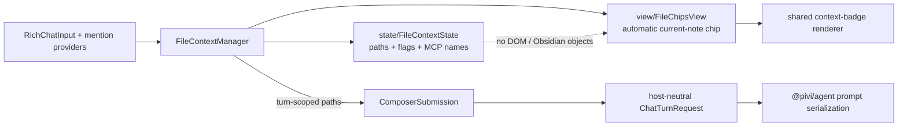

# `src/ui/chat/input/file-context/` — Composer file context chips

*This file extends the root [AGENTS.md](../../../../../AGENTS.md). Follow root guidance first, then these local rules.*

`FileContextManager` coordinates turn-scoped file context, the automatically attached current-note chip, inline file/folder mentions, and MCP mention tracking. Its leaf modules split mutable UI state from the current-note chip view.

## Architecture

The manager coordinates; state owns mutable values; view owns the automatic chip DOM. Final prompt serialization stays outside this module.

## Map

| Path | Responsibility |
|---|---|
| `../FileContext.ts` | Manager for current-note lifecycle, mention providers, Vault event cleanup, folder expansion, and turn context collection |
| `state/FileContextState.ts` | Session/current-note flags plus deduplicated attached-file and MCP-mention sets |
| `view/FileChipsView.ts` | Owner-realm context-badge rendering for the one automatic current-note chip |

## Rules

- UI state belongs in `state/`; DOM chip rendering belongs in `view/`; Vault/mention coordination stays in `FileContextManager`.
- This layer collects and normalizes context paths only. `ComposerSubmission` builds the `ChatTurnRequest`; `@pivi/agent/runtime` prompt helpers perform final serialization.
- Preserve the current-note chip's accessible open/remove controls and cleanup callbacks when adding interactions.
- Do not turn explicit inline file/folder mentions into duplicate chip rows. The rich composer owns those badges; `FileChipsView` renders only the automatic current-note attachment.
