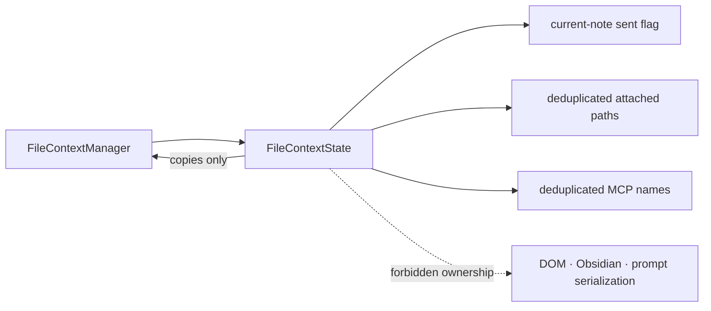

# `src/ui/chat/input/file-context/state/` — File context UI state

*This file extends the root [AGENTS.md](../../../../../../AGENTS.md). Follow root guidance first, then these local rules.*

`FileContextState` tracks session-aware current-note sending, turn-scoped attached file paths, and mentioned MCP server names for the chat input UI. It owns no Obsidian objects or DOM.

## Architecture

## Rules

- Keep this state UI-facing and free of prompt serialization decisions.
- Return copies of owned sets so callers cannot mutate state without the explicit methods.
- Use sets to deduplicate attachments and MCP mentions. New sessions clear every flag/set; loading a non-empty session marks the current note as already sent so it is not reattached.
