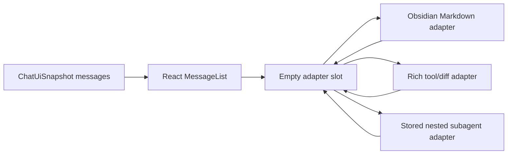

*This file extends the root [AGENTS.md](../../../../AGENTS.md). Follow root guidance first, then these local rules.*

# Chat Rendering

## Purpose

`src/ui/chat/rendering/` contains the imperative owner-realm adapters that React cannot express directly: Obsidian Markdown, rich tool bodies, write/edit diffs, stored nested subagent bodies, and ask-user fallback content.

React components under `packages/pivi-react/src/chat/messages/` own message shells, block ordering, thinking, grouping, actions, duration, and live updates. Stream/runtime code writes serializable `ChatMessage` state only; it must never call or retain adapters from this directory.

Each adapter exclusively owns the children of one empty React-provided container and returns deterministic cleanup. It does not own the container, message order, stream lifecycle, or durable state.

## Key files

| Path | Responsibility |
|---|---|
| `src/ui/chat/rendering/MessageRenderer.ts` | Obsidian Markdown/user-content adapter host plus message scrolling. It does not create message shells. |
| `src/ui/chat/rendering/messageRendererMarkdown.ts` | Obsidian Markdown rendering, mention badges, file-link processing, code wrappers, math, and owner-window-aware Mermaid controls. |
| `src/ui/chat/rendering/ToolCallRenderer.ts`, `toolCallExpandedDispatcher.ts`, `toolCall*Expanded.ts` | Rich tool-body adapter registry used inside React-owned tool slots. |
| `src/ui/chat/rendering/WriteEditRenderer.ts`, `DiffRenderer.ts` | Write/edit diff adapter, context hunks, and bounded new-file rendering. |
| `src/ui/chat/rendering/SubagentRenderer.ts`, `AsyncSubagentRenderer.ts`, `subagentRendererShared.ts` | Stored nested subagent body adapters with stale-render protection. Runtime managers must never call them. |
| `src/ui/chat/rendering/InlineAskUserQuestion.ts`, `inlineAskUserQuestion*.ts` | Interactive ask-user adapter where native input/keyboard behavior remains imperative. |
| `src/ui/chat/rendering/collapsible.ts`, `ToolStepGroupRenderer.ts` | Shared internals used only inside rich adapter-owned containers. |

## Patterns and constraints

- Keep this directory presentation-only. Do not execute tools, mutate vault files, create chat services, interpret provider events, or persist sessions here.
- Consume host-neutral models and helpers from non-engine `@pivi/pivi-agent-core/*` subpaths. Follow the `src/ui/AGENTS.md` prohibition on engine, raw Pi SDK, host-adapter, concrete-tool, and workspace implementation imports.
- Treat `ChatMessage`, `ContentBlock`, `ToolCallInfo`, `ToolDiffData`, `SubagentInfo`, and todo display models as upstream contracts. Normalize or parse only display-specific variants; do not recreate runtime policy.
- Render from durable message state. Stored subagent renderers are owner-realm adapters only; runtime managers and stream coordination must not create, retain, or update their DOM state.
- Extend tool bodies through `toolCallExpandedDispatcher.ts`; block classification, grouping, ordering, labels, and shell state belong to `@pivi/pivi-react`.
- Write/edit, stored nested subagents, and ask-user interaction remain isolated adapters; never route ordinary React-renderable content through them.
- Use `setupCollapsible()` rather than ad hoc toggles. It owns keyboard activation, `aria-expanded`, chevrons, `.expanded`, and `.pivi-hidden`.
- Build DOM with Obsidian helpers and `textContent`/`setText`; tool results and agent output are untrusted display data.
- All plugin chrome and ARIA copy must use `t()` and receive matching locale updates. Raw tool identifiers, commands, paths, results, and agent content may remain untranslated.
- Keep CSS class contracts stable; styling is owned by `packages/pivi-react/styles/`, not this directory.
- Normalize host-rendered task-list, code-copy, and Mermaid nodes onto stable `.pivi-*` presentation classes before package CSS consumes them. Host classes may be queried inside this adapter, but must not become selectors in `packages/pivi-react/styles/`.
- For element-bound document/window work, use `getActiveDocument()` and `getActiveWindow()` so pop-out windows remain functional.
- Preserve accessibility roles, labels, status text, keyboard controls, and decorative `aria-hidden` attributes when changing headers or icons.
- Bound large output. Reuse line caps, compact summaries, diff hunking, and collapsed bodies instead of mounting unlimited result text.
- Imperative nested-subagent step groups mirror the React header contract: count plus unique translated tool names in first-use order, with input/result details confined to expanded rows.

## Gotchas

- Tool icons are a cross-package contract. `getToolIcon()` may return `MCP_ICON_MARKER`, which must go through `appendMcpIcon()` rather than Obsidian `setIcon()`. Do not duplicate icon maps locally.
- Tool semantics are single-sourced in `@pivi/pivi-agent-core/tools/toolPresentation`: add or rename a tool there once for kind, icon, translation keys, visibility/grouping, and summary. `toolPresentationI18n.ts` only translates title/step tokens and composes ARIA text; `obsidianToolResultPresentation.ts` only decides whether structured Obsidian results use the compact imperative body. Expanded-body capability remains in the dispatcher.
- Obsidian tool display names are keyed by canonical constants from `@pivi/pivi-agent-core/tools/obsidianToolNames`; unknown tools intentionally fall back to their raw names.
- `contentBlocks` order is authoritative, but historical/provider data can leave tool calls unreferenced. Preserve orphan rendering and ID deduplication.
- Streaming tool input is reduced into `ChatUiSnapshot` before rendering. React content blocks own order and status; imperative renderers must not retain stream-specific DOM maps or create duplicate tool rows.
- Async Markdown can finish out of order. Subagent rendering uses generation tokens to discard stale completions; preserve that guard when rerendering prompt or result sections.
- Background subagents lazily render expanded content and can become `orphaned` when a session ends. Do not collapse `pending`, `running`, `error`, and `orphaned` into a simple completed flag.
- Thinking presentation and timing belong to the package React message view; no imperative thinking renderer or timer is permitted here.
- Markdown rendering is destructive (`el.empty()`) and asynchronous. It also post-processes links, code blocks, math, and Mermaid, so bypassing it changes behavior and can leak observers or stale output.
- `DiffRenderer` intentionally shows only changed hunks with context and caps all-insert new-file previews. Do not turn it into an unbounded full-file renderer.
- Ask-user rendering has both passive stored-result display and active keyboard-driven interaction. Keep answer extraction compatible with structured `toolUseResult` and text fallback results.
