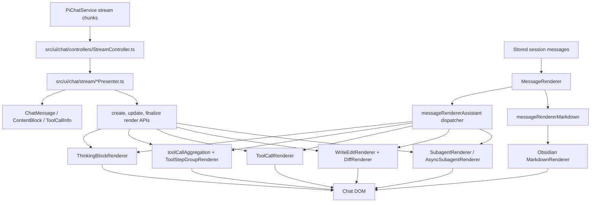
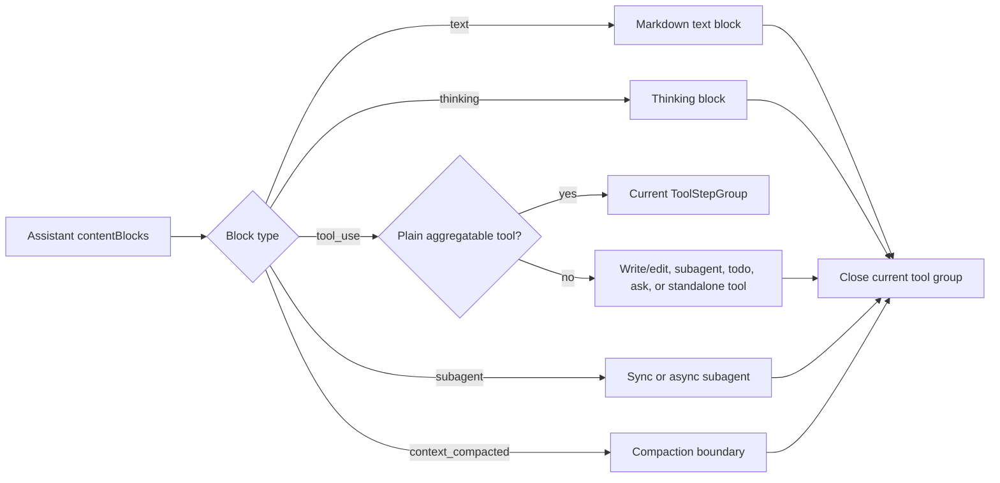

*This file extends the root [AGENTS.md](../../../../AGENTS.md). Follow root guidance first, then these local rules.*

# Chat Rendering

## Purpose

`src/ui/chat/rendering/` is the DOM projection layer for chat history and live stream state. It renders user and assistant messages, Markdown, thinking blocks, tool calls, grouped tool steps, diffs, todos, inline questions, and synchronous/background subagents.

This directory owns presentation and renderer-local DOM state. Stream interpretation and orchestration remain in `src/ui/chat/controllers/` and `src/ui/chat/stream/`; durable message, tool, diff, and subagent models remain in `@pivi/pivi-agent-core`.

## Architecture

Stored messages and live streams converge on the same specialized renderers. `MessageRenderer` handles full-history projection, while stream presenters call the create/update/finalize APIs directly.

Assistant `contentBlocks` preserve provider order. Consecutive plain `tool_use` blocks form a collapsible step group; text, thinking, compaction, subagent, and specialized tool blocks close that group. Tool calls missing from `contentBlocks` are rendered afterward as orphan runs. Legacy messages without `contentBlocks` use `content` plus `toolCalls`.

## Key files

| Path | Responsibility |
|---|---|
| `src/ui/chat/rendering/MessageRenderer.ts` | Public message/history renderer; creates message shells, images, actions, Markdown host context, and scrolling behavior. |
| `src/ui/chat/rendering/messageRendererAssistant.ts` | Assistant content dispatcher; preserves block order, suppresses hidden tools, routes specialized blocks, handles orphan and legacy tool calls. |
| `src/ui/chat/rendering/messageRendererMarkdown.ts` | Obsidian Markdown rendering, mention badges, file-link processing, code wrappers, math streaming behavior, and owner-window-aware Mermaid controls. |
| `src/ui/chat/rendering/ToolCallRenderer.ts` | Generic live/stored tool shell and update path; delegates labels, icons, status, and expanded content. |
| `src/ui/chat/rendering/toolCallAggregation.ts`, `src/ui/chat/rendering/assistantContentSegmentBoundaries.ts`, `src/ui/chat/rendering/ToolStepGroupRenderer.ts` | Decide which tools may be grouped, enforce content boundaries, and maintain grouped live tool state. |
| `src/ui/chat/rendering/toolCallExpandedDispatcher.ts`, `src/ui/chat/rendering/toolCall*Expanded.ts` | Registry-style dispatch and specialized expanded bodies for core, web, patch, skill, Bash, ask-user, and Obsidian tools. |
| `src/ui/chat/rendering/toolCallLabels.ts`, `src/ui/chat/rendering/piviToolDisplay.ts`, `src/ui/chat/rendering/toolCallIcon.ts` | Tool names, summaries, step phrases, ARIA labels, Obsidian display-name mapping, and icon adaptation. |
| `src/ui/chat/rendering/WriteEditRenderer.ts`, `src/ui/chat/rendering/DiffRenderer.ts` | Specialized write/edit lifecycle, diff statistics, context hunks, and bounded new-file rendering. |
| `src/ui/chat/rendering/SubagentRenderer.ts`, `src/ui/chat/rendering/AsyncSubagentRenderer.ts`, `src/ui/chat/rendering/subagentRendererShared.ts` | Sync/background subagent shells, status, nested tool groups, prompt/result Markdown, and stale-render protection. |
| `src/ui/chat/rendering/ThinkingBlockRenderer.ts`, `src/ui/chat/rendering/collapsible.ts` | Thinking lifecycle and shared accessible collapse/expand behavior. |
| `src/ui/chat/rendering/InlineAskUserQuestion.ts`, `src/ui/chat/rendering/inlineAskUserQuestion*.ts` | Interactive question parsing, rendering, selection state, and keyboard navigation. |

## Patterns and constraints

- Keep this directory presentation-only. Do not execute tools, mutate vault files, create chat services, interpret provider events, or persist sessions here.
- Consume host-neutral models and helpers from non-engine `@pivi/pivi-agent-core/*` subpaths. Follow the `src/ui/AGENTS.md` prohibition on engine, raw Pi SDK, host-adapter, concrete-tool, and workspace implementation imports.
- Treat `ChatMessage`, `ContentBlock`, `ToolCallInfo`, `ToolDiffData`, `SubagentInfo`, and todo display models as upstream contracts. Normalize or parse only display-specific variants; do not recreate runtime policy.
- Preserve the paired live/stored APIs. Live stream code uses create/update/finalize functions; session replay uses `renderStored*`. A presentation change usually needs both paths to remain visually equivalent.
- Extend tool rendering through the existing dispatch layers: classification in `messageRendererAssistant.ts`, generic shell in `ToolCallRenderer.ts`, expanded-body registry in `toolCallExpandedDispatcher.ts`, and Obsidian-specific routing in `toolCallObsidianExpanded.ts`.
- Keep aggregation exclusions synchronized. Write/edit, subagent, TodoWrite, AskUserQuestion, hidden lifecycle, and silent `write_stdin` calls are intentionally not ordinary grouped steps.
- Use `setupCollapsible()` rather than ad hoc toggles. It owns keyboard activation, `aria-expanded`, chevrons, `.expanded`, and `.pivi-hidden`.
- Build DOM with Obsidian helpers and `textContent`/`setText`; tool results and agent output are untrusted display data.
- All plugin chrome and ARIA copy must use `t()` and receive matching locale updates. Raw tool identifiers, commands, paths, results, and agent content may remain untranslated.
- Keep CSS class contracts stable; styling is owned by `src/styles/`, not this directory.
- For element-bound document/window work, use `getActiveDocument()` and `getActiveWindow()` so pop-out windows remain functional.
- Preserve accessibility roles, labels, status text, keyboard controls, and decorative `aria-hidden` attributes when changing headers or icons.
- Bound large output. Reuse line caps, compact summaries, diff hunking, and collapsed bodies instead of mounting unlimited result text.

## Gotchas

- Tool icons are a cross-package contract. `getToolIcon()` may return `MCP_ICON_MARKER`, which must go through `appendMcpIcon()` rather than Obsidian `setIcon()`. Do not duplicate icon maps locally.
- Tool identity, visible name, summary, step phrase, and ARIA label are separate mappings. Adding or renaming a tool may require coordinated updates in `toolCallLabels.ts`, `piviToolDisplay.ts`, the expanded dispatcher, i18n, and the upstream icon registry.
- Obsidian tool display names are keyed by canonical constants from `@pivi/pivi-agent-core/tools/obsidianToolNames`; unknown tools intentionally fall back to their raw names.
- `contentBlocks` order is authoritative, but historical/provider data can leave tool calls unreferenced. Preserve orphan rendering and ID deduplication.
- Streaming tool input can arrive incrementally. Update existing headers and group summaries instead of creating duplicate DOM nodes; `toolCallElements` and `data-tool-id` connect result chunks to mounted elements.
- Updates for tools inside a step group must pass through `tryUpdateToolInStepGroup()` so both the nested row and aggregate group header/status stay synchronized.
- Async Markdown can finish out of order. Subagent rendering uses generation tokens to discard stale completions; preserve that guard when rerendering prompt or result sections.
- Background subagents lazily render expanded content and can become `orphaned` when a session ends. Do not collapse `pending`, `running`, `error`, and `orphaned` into a simple completed flag.
- Thinking blocks own timer intervals. Always finalize or clean them up; stored thinking blocks must not start timers.
- Markdown rendering is destructive (`el.empty()`) and asynchronous. It also post-processes links, code blocks, math, and Mermaid, so bypassing it changes behavior and can leak observers or stale output.
- `DiffRenderer` intentionally shows only changed hunks with context and caps all-insert new-file previews. Do not turn it into an unbounded full-file renderer.
- Ask-user rendering has both passive stored-result display and active keyboard-driven interaction. Keep answer extraction compatible with structured `toolUseResult` and text fallback results.
