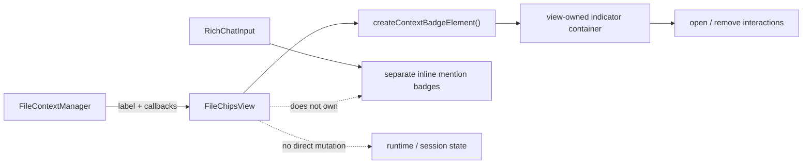

# `src/ui/chat/ui/file-context/view/` — File context chip DOM

*This file extends the root [AGENTS.md](../../../../../../AGENTS.md). Follow root guidance first, then these local rules.*

`FileChipsView` renders the automatically attached current-note chip and its open/remove interactions. Inline mentioned files and folders are rendered inside `RichChatInput` through the separate context-badge path.

## Architecture

## Rules

- Create the chip with the shared `createContextBadgeElement()` path and anchor its document lookup to the view-owned indicator container; use scoped `.pivi-*` classes and accessible labels.
- Keep callbacks injected from UI managers; do not mutate runtime/session state directly.
- `destroy()` must remove the view-owned indicator container without disturbing sibling composer nodes.
