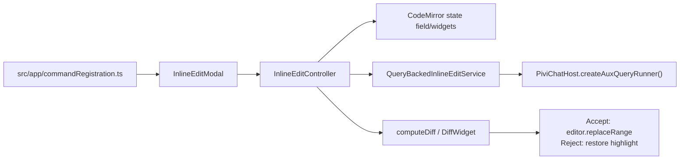

*This file extends the root [AGENTS.md](../../../AGENTS.md). Follow root guidance first, then these local rules.*

# Inline edit UI

## Purpose

`src/ui/inline-edit/` implements Pivi's in-editor AI edit flow. Despite the `InlineEditModal` name, it is not an Obsidian `Modal`: it mounts input and diff widgets directly into the active CodeMirror 6 editor, asks an auxiliary agent query to edit or insert text, and applies changes only after explicit acceptance.

## Architecture

- The app command chooses `selection` mode for nonblank selected text; otherwise it builds cursor context for insertion mode.
- `InlineEditModal.openAndWait()` finds the CM6 `EditorView`, enforces one active controller globally, and resolves when the user accepts or rejects.
- `InlineEditController` owns input, mentions/slash commands, query state, decorations, keyboard handling, and cleanup.
- The first request sends selection/cursor context through `QueryBackedInlineEditService`; clarification replies continue the same auxiliary session.
- Successful output becomes an in-place diff widget. The underlying document is changed only by `accept()`.

## Key files

| File | Role |
|---|---|
| `src/ui/inline-edit/ui/InlineEditModal.ts` | Entry point, editor-view fallback, active-controller coordination, promise-based result |
| `src/ui/inline-edit/ui/inlineEditController.ts` | Flow orchestration, context mentions, auxiliary service, diff/apply/reject lifecycle |
| `src/ui/inline-edit/ui/inlineEditCodeMirror.ts` | CM6 effects, state field, decorations, input/replacement/insertion widgets |
| `src/ui/inline-edit/ui/inlineEditDiff.ts` | Whitespace-preserving word diff and accept/reject widget |
| `src/ui/inline-edit/ui/inlineEditTypes.ts` | Selection/cursor input and decision types |

## Patterns and constraints

- Keep this UI on the injected runtime boundary: call `PiviChatHost.createAuxQueryRunner()` and wrap it with `QueryBackedInlineEditService`. Do not use `PiChatService`, construct Pi runtimes, or import `engine/pi`, `src/app/workspace/**`, or `@pivi/obsidian-host`.
- Use `@/app/hostPlatform` for vault/path operations and `PiviChatHost` as the host type.
- The auxiliary model follows the active chat tab's auxiliary model, falling back to its draft model; absence means runner default.
- Preserve both coordinate systems: CM6 uses absolute offsets, while Obsidian `Editor.replaceRange` uses zero-based `{line, ch}` positions.
- Install the CM extension through `StateEffect.appendConfig`; `installedEditors` prevents duplicate state fields per `EditorView`.
- Selection edits use a block input above the line and a separate selection highlight. Cursor "in-between" edits use an inline widget at the cursor.
- Resolve `@` context references at send time. Support vault wikilinks, normalized vault paths/aliases, and configured external roots; deduplicate resolved paths.
- Slash and mention dropdowns get first chance at key events. Do not submit or accept during IME composition.
- Keep user-visible text translated with `t(...)` and update every locale when changing copy.
- Always cancel/reset the auxiliary session and remove document/editor listeners, dropdowns, decorations, CSS classes, and global active state during cleanup.

## Gotchas

- Prefer the `Editor` supplied to Obsidian's `editorCallback`; active leaves can change during navigation. The view editor is only a fallback.
- `WidgetType.ignoreEvent()` is intentional so controls can handle their own input without CodeMirror consuming events.
- CM decorations map through document transactions, but controller selection offsets are separate mutable state. Recompute positions when selection changes; avoid allowing unrelated document edits between generation and apply.
- Generation removes selection listeners to freeze the request range. Errors must restore positions, decorations, listeners, and focus.
- Replacement previews use `Decoration.replace`; insertion previews use a zero-width widget. Neither mutates the note before acceptance.
- Normalize insertion output before preview/apply. On accept, clean up before calling `replaceRange`; on reject, preserve and restore the original selection highlight.
- Escape rejects throughout; Enter submits while editing and accepts only after a diff is shown.
- Starting inline edit while another controller is active rejects the existing controller and returns rejection instead of opening a second editor.
- `computeDiff` is a word/whitespace LCS with quadratic memory and time; keep it for bounded inline selections, not whole-vault or very large-document diffs.
- Clarifications retain the auxiliary session; acceptance, rejection, and cleanup must reset it.
