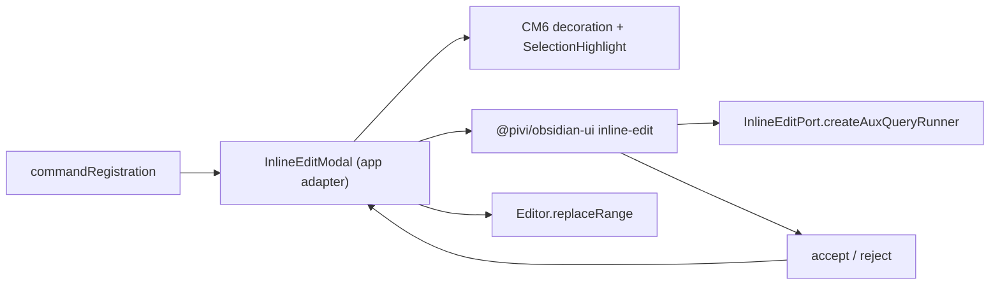

*This file extends the root [AGENTS.md](../../../AGENTS.md). Follow root guidance first, then these local rules.*

# Inline edit UI

## Purpose

`src/ui/inline-edit/` is the app-only adapter for Pivi's in-editor AI edit flow. `InlineEditModal` is not an Obsidian Modal: it maps Obsidian editor state to CM6 decoration positions and mounts the package-owned React UI.

## Architecture

- The command chooses selection mode for nonblank selections; otherwise it builds cursor context.
- `InlineEditModal` owns active-modal replacement, `MarkdownView` teardown, absolute CM offsets, selection highlighting, CM-to-`Editor` coordinate mapping, and the accept/reject result promise.
- `@pivi/obsidian-ui` owns the reducer/controller, `QueryBackedInlineEditService`, React input/reply/spinner/diff/actions, IME-safe keyboard handling, and React mount/dispose.
- `WidgetType.destroy()` disposes the React mount. No legacy visible input or diff WidgetType may be added here.

## Key files

| File | Role |
|---|---|
| `src/ui/inline-edit/ui/InlineEditModal.ts` | App-only CM/Obsidian adapter |
| `packages/obsidian-ui/src/inline-edit/` | React UI, controller/reducer, CM decoration container, deterministic mount/dispose |

## Constraints

- Keep runtime access behind `InlineEditPort`; package code must not import app modules, `@/`, `engine/pi`, or Obsidian host implementations.
- The app command registration injects `createInlineEditPort(plugin)` into `InlineEditModal`; the adapter passes that port, the shared translator, and the CM widget's owner document/window into the React mount.
- Preserve absolute CM offsets until accept, then translate them to zero-based `{ line, ch }` for `Editor.replaceRange`.
- Selection mode is a block widget plus `SelectionHighlight`; in-between cursor mode is an inline widget. Reject restores the original selection highlight.
- The auxiliary model follows the active tab's auxiliary model, then its draft model, then the runner default.
- Clarifications retain their auxiliary session. Accept, reject, cancellation, replacement by a new inline edit, and view teardown reset/cancel it.
- `computeDiff` is word/whitespace LCS; use it only for bounded inline selections.

## Verification

- Cover React state transitions (generate, clarification, diff, accept, reject, error, cancel) in `tests/obsidian-ui/InlineEdit.test.tsx`.
- Cover CM decoration removal so `WidgetType.destroy()` unmounts the owner-realm React root.
- Run the focused Jest test, focused lint, and source typecheck after changing this boundary.
