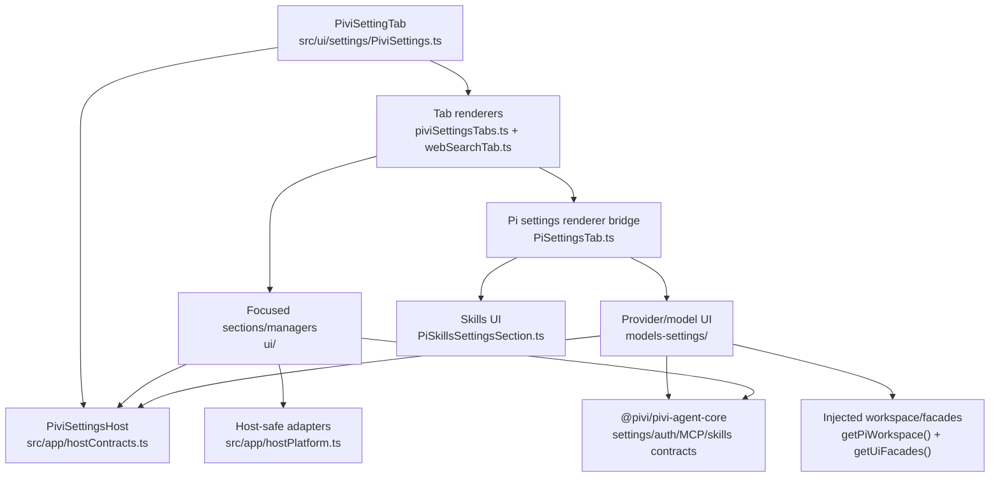

*This file extends the root [AGENTS.md](../../../AGENTS.md). Follow root guidance first, then these local rules.*

# Settings UI

## Purpose

`src/ui/settings/` owns Pivi's Obsidian settings tab: navigation, settings persistence, provider/model authentication, skills, tools, subagents, web search, slash commands, and vault-local MCP configuration.

Keep this layer focused on presentation and coordination. Runtime behavior, provider semantics, settings normalization, MCP types, and skills catalogs belong in their owning `@pivi/pivi-agent-core/*` modules. Obsidian-specific capabilities must arrive through host contracts or `src/app/hostPlatform.ts`.

## Architecture

`PiviSettingTab` renders all tab containers and toggles visibility without reconstructing them on every tab click. A full redisplay disposes stateful managers, clears the container, and rebuilds every tab.

The Models and Skills tabs are delegated through the workspace's `AgentSettingsTabRenderer`. `PiSettingsTab.ts` adapts `AgentSettingsTabRendererContext` back to the narrow `PiviSettingsHost` used by the local sections.

## Key files and subdirectories

- `src/ui/settings/PiviSettings.ts` — `PluginSettingTab` entry point, tab navigation, locale synchronization, redisplay/scroll preservation, manager disposal, and active-service prompt refresh.
- `src/ui/settings/piviSettingsTabs.ts` — composes General, Models, Skills, Tools, Subagents, Commands, and MCP tabs.
- `src/ui/settings/webSearchTab.ts` — search/fetch provider selection and keychain-backed web-search credentials.
- `src/ui/settings/PiSettingsTab.ts` — Models/Skills renderer bridge registered with the Pi workspace.
- `src/ui/settings/PiSkillsSettingsSection.ts` — vault skill listing, installation, updates, enable/disable, and removal.
- `src/ui/settings/models-settings/` — provider cards, credentials, OAuth, custom endpoints, model visibility, provider readiness, and add/remove flows.
- `src/ui/settings/models-settings/index.ts` — model settings entry point; migrates legacy credentials, filters unsupported providers, syncs custom providers, and creates render state.
- `src/ui/settings/models-settings/renderProviderRow.ts` — expandable provider card and readiness status; composes auth, custom-provider, model checklist, and test controls.
- `src/ui/settings/models-settings/types.ts` — mutable projection over canonical Pi settings via `getPiAgentSettings`/`updatePiAgentSettings`.
- `src/ui/settings/ui/` — focused settings sections plus stateful MCP and slash-command managers/modals.
- `src/ui/settings/ui/McpSettingsManager.ts` — vault-local MCP CRUD, import, OAuth, testing, tool toggles, persistence, and runtime reload.
- `src/ui/settings/piviSettingsHotkeys.ts` — tool metadata, displayed hotkeys, and scroll snapshots; it accesses typed Obsidian settings/hotkey internals cautiously.
- `src/ui/settings/keyboardNavigation.ts` — parses and serializes Vim-style navigation mappings.
- `src/ui/settings/settingsActionIcons.ts` — safe SVG construction without `innerHTML`.

## Patterns and constraints

### Host and dependency boundaries

- Type settings-facing code against `PiviSettingsHost`, not the full plugin, except `PiviSettingTab`, whose Obsidian superclass requires `PiviPluginHost`.
- Use host methods for persistence and side effects: mutate `plugin.settings`, call `plugin.saveSettings()`, then refresh affected views/services.
- Reach optional runtime capabilities through `plugin.getPiWorkspace()` and UI-safe operations through `plugin.getUiFacades()`. Treat absent workspace services as a valid initialization state.
- Do not import `@pivi/pivi-agent-core/engine/pi`, raw `@earendil-works/*`, `src/app/workspace/**`, or `@pivi/obsidian-host`.
- Use `src/app/hostPlatform.ts` for platform/host adapters such as filesystem path normalization, vault-path lookup, official CLI detection, and agent settings renderer contracts.
- Import host-neutral settings, auth, model, MCP, and skills types/helpers from their public `@pivi/pivi-agent-core/*` subpaths. Do not duplicate normalization or readiness logic in UI code.
- Settings UI may use the public `obsidian` UI API (`Setting`, `Modal`, `Notice`, `setIcon`, etc.); keep non-public host access isolated and structurally typed.

### Rendering and persistence

- Prefer small `render...Section(options)` functions for stateless sections. Use manager classes only when asynchronous loading, modal coordination, or event-listener lifecycle requires retained state.
- On full redisplay, dispose managers before emptying the container. New stateful managers must expose `dispose()` and be registered with `PiviSettingTab`.
- Use `redisplayPreservingScroll()` when a change rebuilds the current page but should not move the user.
- After model/provider visibility, enablement, or catalog changes, refresh every affected view (`refreshModelSelector()` or cache invalidation), not only the current view.
- Prompt/tool/environment changes generally require `restartServiceForPromptChange()` after saving so open tabs synchronize their system prompt. Its failure is intentionally non-fatal; the next session initialization applies the change.
- Use canonical resolver/update helpers before writing nested settings. Preserve unrelated fields with object spreads.
- Prefer blur/explicit actions for text areas that cause expensive persistence or runtime restarts. If debouncing, use `window.setTimeout`/`window.clearTimeout`.
- Async UI controls should prevent duplicate submissions, restore disabled/label state in `finally`, and surface actionable failures with translated `Notice` text.

### Models and providers

- Provider credentials belong in the injected credential store backed by Obsidian `secretStorage`, never plaintext plugin settings. Display only a fixed masked value and clear legacy environment-variable credentials after migration/write.
- Built-in providers come from the supported provider catalog. Custom/local providers use `CustomProviderConfig`, must be synchronized through `getUiFacades().syncCustomProviders()`, and may fetch model catalogs through the facade.
- Provider readiness must use `deriveProviderReadinessStatus`; it combines disabled state, credentials/OAuth expiry, model availability, and keyless custom-provider support.
- `visibleModels` controls the model checklist and selectors. Provider removal must also remove that provider's visible models and custom configuration.
- Codex OAuth is a dedicated flow through `providerOAuth`; generic API-key/OAuth-token editing belongs in `credentialsSection.ts`.
- Expanded provider cards are ephemeral module state retained across redisplays and cleared when the settings tab hides.

### Internationalization and UI conventions

- Every user-visible label, description, button, placeholder, tooltip, aria-label, empty state, validation message, and Notice must use `t()` from `src/i18n/`.
- Add/update the canonical key in `src/i18n/locales/en.json` and mirror the key tree with translations in every locale in the same change.
- Raw user content, provider/model/tool identifiers, URLs, command examples, and recognized brand names may remain untranslated.
- Keep English source copy in sentence case. Respect `obsidianmd/ui/sentence-case` configured acronyms/brands rather than adding ad hoc capitalization.
- Build settings headings with `new Setting(container).setName(...).setHeading()`. Do not manually create HTML heading elements or use problematic heading structure.
- Use Obsidian controls and `setIcon` where practical. If custom DOM is required, provide translated accessible names and construct SVG safely without `innerHTML`.

## Gotchas

- Obsidian keychain support is required for provider credentials; render the minimum-version warning when `secretStorage` is unavailable and keep controls safely disabled when stores are absent.
- A full redisplay destroys DOM-local state. Persist intentional transient state separately, as provider cards do, and avoid stale async writes after manager disposal.
- MCP persistence is vault-local. Successful disk saves followed by failed runtime reloads must not be rolled back; warn that reload failed instead.
- MCP tool toggles use optimistic UI with rollback on save failure. Preserve that behavior when changing the test modal or manager.
- Custom provider endpoint/name edits and model fetches must synchronize both the local Pi settings projection and facade-managed provider catalog.
- Environment variables have scoped ownership and review warnings. Use `PiviSettingsHost.applyEnvironmentVariables*`; do not directly rewrite environment text.
- External-read directories must remain absolute, normalized, validated, non-duplicated, and non-overlapping; also synchronize pinned external context paths after changes.
- Tool availability can depend on Codex auth, official Obsidian CLI availability, or external-read permission. Disabled UI state is not equivalent to a persisted disabled-tool entry.
- `piviSettingsHotkeys.ts` touches undocumented Obsidian settings/hotkey internals through optional structural types. Keep all accesses guarded and do not spread those internals elsewhere.
- ESLint enforces Obsidian settings rules, platform usage, supported APIs, window timers, forbidden elements, and sentence case. Numeric/technical placeholders and identifiers are exceptions; ordinary UI prose is not.
