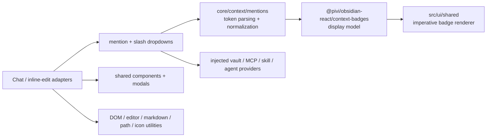

*This file extends the root [AGENTS.md](../../../AGENTS.md). Follow root guidance first, then these local rules.*

# Shared UI

## Purpose

`src/ui/shared/` owns reusable imperative presentation and composer infrastructure used by chat and inline-edit adapters. Keep this layer UI-focused: coordinate mention/slash dropdowns, render context badges, and bridge small Obsidian DOM/editor interactions. Pure mention parsing lives in `@pivi/pivi-agent-core/context/mentions`, slash matching lives under core skills, and context-badge view models remain in the React `context-badges` presentation subpath; product workflow and runtime semantics belong in their owning feature, app, or `@pivi/*` package.

## Architecture

The token text is canonical. Rich composers replace recognized text with non-editable badges carrying the original token in `data-mention-token`; extraction reconstructs the same plain text before submission. Stored messages are parsed again to render equivalent badges.

## Key subdirectories and files

- `src/ui/shared/mention/`: the composer mention system. `MentionDropdownController.ts` coordinates suggestions through callbacks/providers; token recognition uses core `context/mentions` with a narrow `MentionVaultLookup`; `createMentionVaultLookup` and `obsidianMentionVault` adapt Obsidian metadata/path behavior outside core; `inlineMentionBadgeDom.ts` preserves the text/DOM round trip; vault caches and item builders keep file/folder lookup out of controllers; `expandFolderMentions.ts` expands vault folders into context-file paths.
- `src/ui/shared/context-badge/`: token conversion plus imperative DOM rendering for files, folders, attachments, MCP tools, skills, agents, and inline selections. It consumes the core mention parser and React-owned context-badge display model; use it instead of inventing feature-specific chips.
- `src/ui/shared/components/`: generic selectable dropdown; slash-command/skill/MCP-tool catalog with fuzzy matching and stale-request guards; and a lazily installed CodeMirror 6 selection highlight.
- `src/ui/shared/modals/`: promise-based confirmation helpers and the create/edit custom slash-command modal. Callers own persistence; modal copy is localized.
- `src/ui/shared/dom.ts`: popout-safe document/window lookup. Resolve globals from the owning element whenever possible.
- `src/ui/shared/utils/`: focused helpers for Obsidian links, editor access, external-context paths and folder picking, icons/provider logos, animation frames, and inline-edit text. Pure streaming-math escaping lives in core foundation.

## Mention and command flow

- `@` suggestions cover vault files/folders, selected external-context roots, and an `Agents/` submenu. File selection also invokes `onAttachFile`; aliases are inserted as `@[[path|alias]]` only when safe. Agent tokens use `@id (agent)`.
- Parsing only starts `@` or `/` tokens at the beginning of text or after whitespace. It resolves inline-context tokens first, then agents, wikilinks, external roots, and vault paths. Unknown tokens remain plain text.
- File/folder mentions may contain spaces because resolution chooses the longest valid vault lookup match. Preserve punctuation, path normalization, Windows case handling, aliases, and wikilink behavior when changing the parser.
- External-context mentions represent configured root folders only. They resolve display labels to absolute roots at send time and must not recursively enumerate external files. Duplicate root names are disambiguated with one parent segment.
- Vault folder mentions recursively contribute vault-relative paths to `<context_files>`; file content is not read here. Absolute external roots are deliberately excluded from expansion.
- Current MCP syntax is `/server` or `/server/tool`, not an `@` token. Slash badges still use known context-saving server names for composer highlighting; settings-enabled servers are always available to the agent. Turn finalization in `@pivi/pivi-agent-core` appends ` MCP` to valid slash tokens for the API prompt while persisted/visible text stays unchanged.
- Slash suggestions merge runtime skills, enabled MCP tools, and the injected command catalog. Catalog + MCP tool entries are prefetched at tab/plugin startup (and after MCP/settings invalidation) so first `/` open is sync from cache. Names are deduplicated case-insensitively, hidden commands are filtered, async results use request IDs, and selected text is inserted before callbacks run.

## Patterns and constraints

- Keep dependencies pointing toward host-neutral Pivi contracts (`foundation`, `context`, `skills`, etc.). Never import `@pivi/pivi-agent-core/engine/pi`, raw Pi SDKs, `@pivi/obsidian-host`, or `src/app/workspace/**` here. Use injected structural providers/callbacks; use `src/app/hostPlatform.ts` only for the approved host-platform facade.
- Direct public `obsidian` imports are appropriate for UI primitives (`App`, `Modal`, `Setting`, `TFile`, `TFolder`, `setIcon`) and workspace rendering. Do not move product/runtime composition into these helpers.
- Keep parsers, scoring, normalization, and view-model creation as pure as practical. DOM renderers consume typed tokens/view models and callbacks rather than feature state.
- Preserve the separation between core mention token parsing, React context-badge display modeling, and imperative rendering. Add a new mention kind across core `mentionTypes.ts`, parser conversion, React `context-badges` contracts/model, and the imperative renderer together.
- Use `ownerDocument` / `getActiveDocument()` and `getActiveWindow()` for created DOM, selections, timers, and geometry so popout windows work. Avoid adding new direct `window`/`document` assumptions.
- Dropdown keyboard handlers return whether they consumed the event. Keep Arrow, Enter/Tab, Escape, focus restoration, scrolling, click propagation, and fixed-versus-anchored positioning behavior consistent.
- Respect IME composition. Do not accept mentions on composing Enter/Tab or rebuild a rich composer on every keystroke; badge synchronization waits for a completed token/whitespace boundary.
- User-visible copy must use the shared translator from `@/app/i18n`; technical token labels and user content may remain literal. Preserve accessible roles, labels, keyboard removal, and focus/cursor restoration.
- Provider logos must remain bundled/local. Do not add runtime CDN fetches; use bundled SVG masks or Lucide fallbacks.

## Gotchas

- Obsidian extends DOM prototypes (`empty`, `createDiv`, `addClass`, `instanceOf`, and related helpers). Tests and popout documents must provide compatible behavior; do not casually replace `instanceOf` with realm-sensitive `instanceof` for DOM nodes.
- `parseMessageMentions()` builds a vault lookup and may inspect all files/folders. Use `VaultMentionDataProvider` for interactive dropdown data, mark caches dirty on vault changes, and retain stale cache data when refresh fails.
- Empty-query vault suggestions prioritize the active file, then recency; alias hydration is deferred until after the first 100 files are selected. Search results cap files at 100 and folders at 50.
- Inline badges are not the source of truth: `data-mention-token` is. Changing a visible label must not mutate submitted text. Inline-context badges are removable; ordinary inline mention badges generally are not.
- Context badges render as `span` only in inline mode and as `button` otherwise. Disabled folder/tool badges intentionally do not navigate; file badges require an explicit click callback.
- Streaming math escaping is transient and must skip fenced code, inline code, pre-escaped dollars, and HTML tags. Do not persist the escaped rendering form.
- `processFileLinks()` mutates rendered Markdown after Obsidian rendering, repairs app/Obsidian URIs and embeds, and deliberately skips code blocks/anchors during text-node walks. Register delegated handlers through an Obsidian `Component` for cleanup.
- Folder picking and synchronous filesystem validation are desktop/Electron-only and can throw or block; callers must own user-facing failure handling. External path availability is checked per turn so temporarily unavailable pinned roots are retained.
