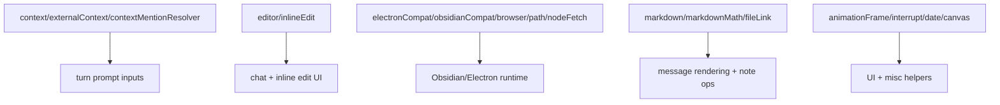

# `src/utils/` — Cross-cutting helpers

Framework-neutral helpers used by features and Pi product modules. Keep utilities small and side-effect free unless the filename explicitly describes a platform patch. Domain-specific logic (diff, agent, env, frontmatter, mcp, session, slashCommand, subagentJsonl, vaultEditMatch) has been moved to `src/pi/` subdirectories.

## Helper groups

## Rules

- Avoid adding domain orchestration here; put stable domain rules in `src/pi/` and feature-specific behavior in `src/features/`.
- Keep side effects explicit. Compatibility patches must be called intentionally from entry points (`main.ts` does this for renderer patches).
- Prefer pure functions and typed inputs/outputs; avoid hidden global state.
- Be careful with Obsidian/mobile compatibility: avoid browser/Node assumptions unless guarded by the caller or helper.
