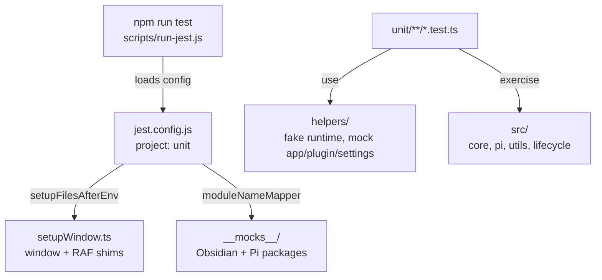

# `tests/` — Jest unit tests

Unit tests for Pivi run in Node via Jest 30. Use the npm scripts, not direct `npx jest`, because `scripts/run-jest.js` provides the Node localStorage file expected by Pi/Obsidian mocks.

## Test topology



## Commands

```bash
# All unit tests
npm run test

# Coverage (CI command)
npm run test:coverage

# One file
npm run test -- tests/unit/pi/PiMcpBridge.test.ts

# One file in-band
npm run test -- --runInBand tests/unit/pi/PiMcpBridge.test.ts

# By test name
npm run test -- -t "merges toolbar-enabled servers"
```

## Layout

- `setupWindow.ts` — ensures `globalThis.window` and animation-frame shims exist.
- `setupPiAgent.ts` — shared Pi bootstrap helper.
- `__mocks__/obsidian.ts` — unified Obsidian API mock.
- `__mocks__/@earendil-works/*` — Pi package mocks for agent core, pi-ai, OAuth, and coding-agent APIs.
- `helpers/` — fake `ChatRuntime`, mock `App`, plugin, and settings builders.
- `unit/agent/` — core agent facade tests.
- `unit/main/` — plugin lifecycle tests.
- `unit/pi/` — Pi adaptor, MCP, sessions, tools, runtime prompt, slash catalog tests.
- `unit/utils/` — pure utility tests.

## Patterns and constraints

- Prefer testing through core facades/ports when validating feature-facing behavior.
- Pi adaptor tests may import `src/pi/**` directly; feature tests should still respect the production seam.
- Keep mocks centralized in `__mocks__/` or `helpers/`; avoid ad hoc large inline mocks in each test.
- Tests run in Node, not jsdom. Add only the minimal DOM/window shim needed by the code under test.
