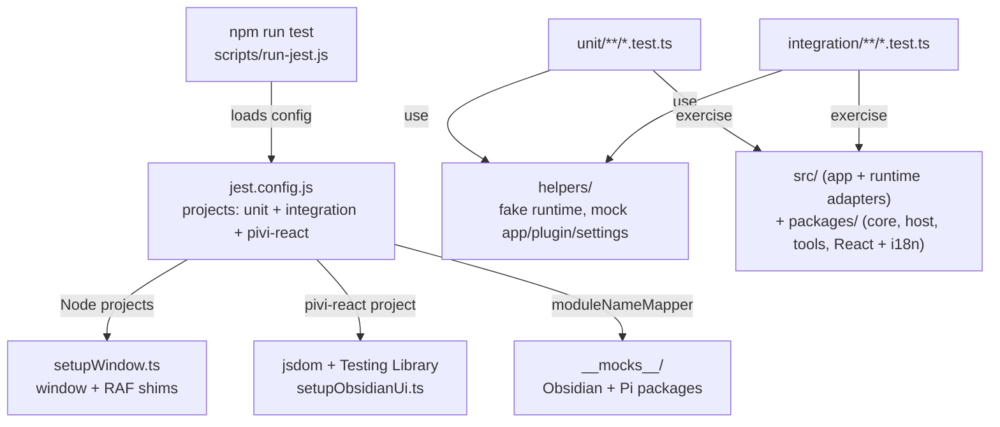

# `tests/` — Jest tests

*This file extends the root [AGENTS.md](../AGENTS.md). Follow root guidance first, then these local rules.*

Unit and integration tests for Pivi run in Node via Jest 30. Use the npm scripts, not direct `npx jest`, because `scripts/run-jest.js` provides the Node localStorage file expected by Pi/Obsidian mocks.

## Test topology



## Commands

```bash
# All Jest projects
npm run test

# List tests across projects
npm run test -- --listTests

# Coverage (CI command)
npm run test:coverage

# One file
npm run test -- tests/unit/pi/piMcpBridge.test.ts

# One file in-band
npm run test -- --runInBand tests/unit/pi/piMcpBridge.test.ts

# By test name
npm run test -- -t "merges toolbar-enabled servers"
```

## Layout

- `setupWindow.ts` — ensures `globalThis.window` and animation-frame shims exist.
- `setupObsidianUi.ts` — installs Testing Library DOM matchers for the jsdom React project.
- `pivi-react/` — React/TSX behavior tests running in the dedicated jsdom project.
- `pivi-react/` also hosts owner-DOM tests for the uncontrolled rich composer and imperative mention dropdown when real selection, keyboard, and Obsidian DOM-helper behavior matters.
- `__mocks__/obsidian.ts` — unified Obsidian API mock.
- `__mocks__/@earendil-works/*` — Pi package mocks for agent core, pi-ai, OAuth, and coding-agent APIs.
- `helpers/` — fake `PiChatService`, mock `App`, plugin, and settings builders.
- `integration/` — integration-project tests that still run in Node using the shared mocks/setup.
- `unit/app/` — app service/session/settings persistence tests.
- `unit/architecture/` — dependency boundary and architecture guard tests.
- `unit/engine/` — host-neutral engine/runtime tests.
- `unit/features/` — feature UI/service tests such as chat tab lifecycle and fork flows.
- `unit/main/` — plugin lifecycle tests.
- `unit/pi/` — Pi engine, MCP, sessions, tools, runtime prompt, auth, and slash catalog tests.
- `unit/pivi-agent-core/` — aggregate package host/runtime contract tests.
- `unit/scripts/` — build compatibility, CSS manifest, and Jest project-discovery tests.
- `unit/ui/` — imperative DOM and response/tool/subagent CSS contract tests; React and settings behavior belongs in `pivi-react/`.
- `unit/utils/` — pure utility tests.

## Patterns and constraints

- Prefer testing through explicit feature/plugin dependencies when validating feature-facing behavior.
- Pi and feature tests should import Pivi-owned package APIs (`@pivi/*`) or the app shell package; keep low-level external SDK mocks centralized.
- Keep mocks centralized in `__mocks__/` or `helpers/`; avoid ad hoc large inline mocks in each test.
- Existing unit and integration projects run in Node. Only `tests/pivi-react/**` runs in jsdom; keep DOM-heavy React tests there.
- Architecture fixtures lock the four ownership seams: core owns runtime/application ports, app owns concrete wiring, `@pivi/pivi-react` owns React presentation, and `src/ui` owns remaining product orchestration and imperative adapters. React portability fixtures additionally reject host DOM classes, host-specific public port identifiers, host-specific locale keys, and unparameterized credential/workspace copy while proving that `pivi-*` classes and app-owned host adapters remain valid.
