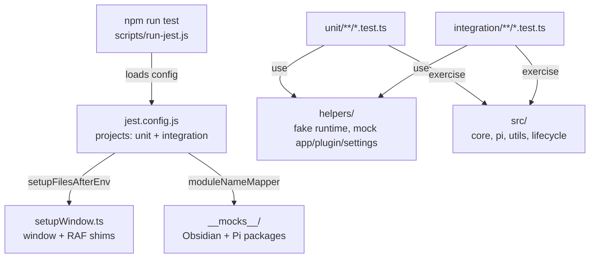

# `tests/` — Jest tests

*This file extends the root [AGENTS.md](../AGENTS.md). Follow root guidance first, then these local rules.*

Unit and integration tests for Pivi run in Node via Jest 30. Use the npm scripts, not direct `npx jest`, because `scripts/run-jest.js` provides the Node localStorage file expected by Pi/Obsidian mocks.

## Test topology



## Commands

```bash
# All Jest projects
npm run test

# List tests across projects
npm run test -- --listTests

# Coverage (CI command)
npm run test:coverage

# One file
npm run test -- tests/unit/pi/piMcpBridge.test.ts

# One file in-band
npm run test -- --runInBand tests/unit/pi/piMcpBridge.test.ts

# By test name
npm run test -- -t "merges toolbar-enabled servers"
```

## Layout

- `setupWindow.ts` — ensures `globalThis.window` and animation-frame shims exist.
- `setupPiAgent.ts` — legacy no-op retained for older tests that import it.
- `__mocks__/obsidian.ts` — unified Obsidian API mock.
- `__mocks__/@earendil-works/*` — Pi package mocks for agent core, pi-ai, OAuth, and coding-agent APIs.
- `helpers/` — fake `PiChatService`, mock `App`, plugin, and settings builders.
- `integration/` — integration-project tests that still run in Node using the shared mocks/setup.
- `unit/main/` — plugin lifecycle tests.
- `unit/pi/` — Pi adaptor, MCP, sessions, tools, runtime prompt, slash catalog tests.
- `unit/core/storage/` — file adapter persistence tests.
- `unit/features/chat/` — tab lifecycle and fork/plan tests.
- `unit/i18n/` — locale and translation tests.
- `unit/utils/` — pure utility tests.

## Patterns and constraints

- Prefer testing through explicit feature/plugin dependencies when validating feature-facing behavior.
- Pi and feature tests should import Pivi-owned package APIs (`@pivi/*`) or the app shell package; keep low-level external SDK mocks centralized.
- Keep mocks centralized in `__mocks__/` or `helpers/`; avoid ad hoc large inline mocks in each test.
- Tests run in Node, not jsdom. Add only the minimal DOM/window shim needed by the code under test.
